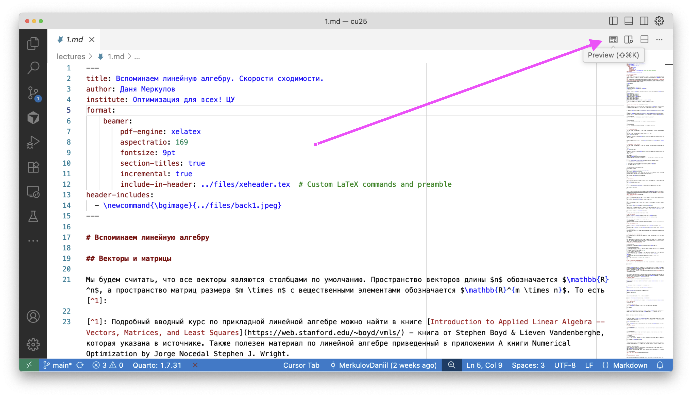
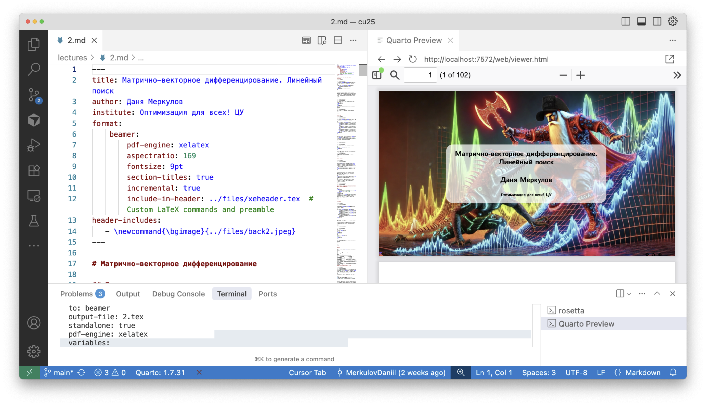

# Учебные материалы: как собрать презентации и сайт

Ниже — пошаговая инструкция: от установки редактора до сборки презентаций (PDF Beamer) и всего сайта (Quarto website). Инструкция кроссплатформенная (Windows/macOS/Linux).

## 1. Установить редактор: VS Code или Cursor
- VS Code: <https://code.visualstudio.com/>
- Cursor: <https://www.cursor.com/>

## 2. Установить Quarto (CLI)
- Скачать установщик: <https://quarto.org/docs/download/>
- Проверить установку:
```bash
quarto --version
```

## 3. Клонировать репозиторий
Репозиторий: <https://github.com/MerkulovDaniil/cu25>

<details>
  <summary><b>Клонировать через GitHub Desktop</b></summary>
  <p>Если не установлен, скачайте GitHub Desktop: <https://desktop.github.com/></p>
  <ol>
    <li>Откройте GitHub Desktop → File → Clone repository → URL → вставьте <code>https://github.com/MerkulovDaniil/cu25</code></li>
    <li>Выберите локальную папку, например: <code>~/work/cu25</code> или <code>C:\\work\\cu25</code></li>
    <li>Нажмите Clone</li>
  </ol>
</details>

<details>
  <summary><b>Клонировать через терминал (Git)</b></summary>

```bash
mkdir -p ~/work && cd ~/work
# Windows (PowerShell): New-Item -ItemType Directory -Force C:\work; Set-Location C:\work

git clone https://github.com/MerkulovDaniil/cu25.git
cd cu25
```
</details>

<details>
  <summary><b>Скачать ZIP с сайта</b></summary>
  <ol>
    <li>Откройте страницу репозитория → Code → Download ZIP</li>
    <li>Распакуйте в удобную папку, например <code>~/work/cu25</code> или <code>C:\\work\\cu25</code></li>
  </ol>
</details>

## 4. Установить TinyTeX (для PDF/Beamer, XeLaTeX)
Quarto может установить компактный LaTeX-дистрибутив:
```bash
quarto install tinytex
```
Проверить XeLaTeX:
```bash
xelatex --version
```
Если не хватает LaTeX-пакетов, TinyTeX обычно доустанавливает их при первой сборке.

(Альтернатива — полноценные дистрибутивы вроде TeX Live или MacTeX; ставьте по желанию.)

## 5. Установить расширение Quarto в VS Code/Cursor
- Расширение: <https://marketplace.visualstudio.com/items?itemName=quarto.quarto>

Даст кнопки Render/Preview и интеграцию с панелями задач.

## 6. Сборка презентации (PDF, Beamer)
Откройте нужный файл, например `presentations/1.md` или `presentations/2.md`.
В каждом из них указано:
- `format: beamer` c `pdf-engine: xelatex`
- `include-in-header: ../files/xeheader.tex` (подключение стилевого заголовка)
- фон титульного слайда задаётся в преамбуле через `\newcommand{\bgimage}{../files/backX.jpeg}`

Собрать презентацию:
- В редакторе: кнопка Render



- Или командой из корня репозитория:

```bash
quarto preview ./lectures/2.md --no-browser --no-watch-inputs
```

получится так:


или

```bash
quarto render presentations/2.md --to beamer-pdf
```

PDF появится рядом с исходником (или в указанной директории вывода, если переопределено).

## 7. Сборка всего сайта (учебные материалы)


Локальный просмотр с автообновлением:
```bash
quarto preview
```
Откроется локальный сервер. HTML-страницы используют формат `fminxyz-html` из `/_extensions/fminxyz`, KaTeX подключается из CDN.
Собрать сайт (из корня репозитория):
```bash
quarto render
```

## 8. Где находятся стилевые файлы
- Презентации (Beamer, XeLaTeX): `files/xeheader.tex`
  - Подключается в презентациях через `include-in-header: ../files/xeheader.tex`.
  - Часть оформления задаётся прямо в преамбуле презентации (например, фоновое изображение титула — макрос `\bgimage`).
- Длинные PDF (longread): `files/longread_header.tex`
  - Использует шрифты из `files/palatino` (пути прописаны внутри `longread_header.tex`).

## Шпаргалка. Команды
```bash
# Сайт целиком
quarto render
quarto preview

# Одна HTML-страница
quarto render lectures/2.md

# Одна презентация PDF (Beamer)
quarto render presentations/2.md --to beamer-pdf

# Установка TinyTeX (если не установлен)
quarto install tinytex
```