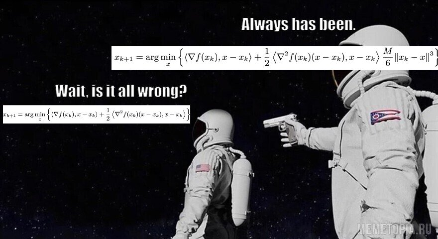

# Воспоминания с лекции
## Идея метода Ньютона для нахождения корней функции

:::: {.columns}

::: {.column width="60%"}

:::

::: {.column width="40%"}
Рассмотрим функцию $\varphi(x): \mathbb{R} \to \mathbb{R}$. 
Мы хотим найти корень уравнения $\varphi(x) = 0$.

Основная идея заключается в том, чтобы построить линейное приближение в точке $x_k$ и найти его корень, который будет новой точкой итерации:

$$
\varphi'(x_k) = \frac{\varphi(x_k)}{x_{k+1} - x_k}
$$

Мы получаем итерационную схему:
$$
x_{k+1} = x_k - \dfrac{\varphi(x_k)}{\varphi'(x_k)}.
$$

Теперь, если мы рассмотрим $\varphi(x) \equiv \nabla f(x)$, это станет методом оптимизации Ньютона:

$$
x_{k+1} = x_k - \left[ \nabla^2 f(x_k)\right]^{-1} \nabla f(x_k)
$$
:::

::::

## Пример метода линеаризации Ньютона

::: {.callout-question title="Метод Ньютона"}
Примените метод Ньютона для нахождения корня уравнения $\varphi(t)=0$ и определите область сходимости:

$$
\varphi(t) = \dfrac{t}{\sqrt{1 + t^2}}
$$
::: 

. . .

1. Найдем производную:
$$
\varphi^{\prime}(t) = - \dfrac{t^2}{(1 + t^2)^{\frac{3}{2}}} + \dfrac{1}{\sqrt{1 + t^2}}
$$

. . .

2. Тогда итерация метода принимает вид:

$$
x_{k+1} = x_k - \dfrac{\varphi(x_k)}{\varphi'(x_k)} = x_k - x_k(x_k^2 + 1) = - x_k^3
$$

. . .

::: {.callout-important icon="false" appearance="simple"}

Легко видеть, что метод сходится только если $|x_0| < 1$, подчеркивая **локальный** характер метода Ньютона.

:::

## Метод Ньютона как оптимизация локальной квадратичной аппроксимации

Пусть у нас есть функция $f(x)$ и некоторая точка $x_k$. Рассмотрим квадратичное приближение этой функции в окрестности $x_k$:
$$
f^{II}_{x_k}(x) = f(x_k) + \langle \nabla f(x_k), x - x_k\rangle + \frac{1}{2} \langle \nabla^2 f(x_k)(x-x_k), x-x_k \rangle. 
$$

. . .

Идея метода заключается в том, чтобы найти точку $x_{k+1}$, которая минимизирует функцию $f^{II}(x)$, т.е. $\nabla f^{II}(x_{k+1}) = 0$.
$$
\begin{aligned}
x_{k + 1} &= \arg \min_x \left\{f(x_k) + \langle \nabla f(x_k), x - x_k \rangle + \frac{1}{2} \left\langle\nabla^2 f(x_k) (x - x_k), x - x_k\right\rangle \right\} \\
\nabla f^{II}_{x_k}(x_{k+1})  &= \nabla f(x_{k}) + \nabla^2 f(x_k)(x_{k+1} - x_k) = 0 \\
\nabla^2 f(x_k)(x_{k+1} - x_k) &= -\nabla f(x_{k}) \\
\left[ \nabla^2 f(x_k)\right]^{-1} \nabla^2 f(x_k)(x_{k+1} - x_k) &= -\left[ \nabla^2 f(x_k)\right]^{-1} \nabla f(x_{k}) \\
x_{k+1} &= x_k -\left[ \nabla^2 f(x_k)\right]^{-1} \nabla f(x_{k}).
\end{aligned}
$$

. . .

::: {.callout-important icon="false" appearance="simple"}
Обратите внимание на ограничения, связанные с необходимостью невырожденности (для существования метода) и положительной определенности (для гарантии сходимости) гессиана.
:::

## Метод Ньютона как оптимизация локальной квадратичной аппроксимации

## Метод Ньютона как оптимизация локальной квадратичной аппроксимации {.noframenumbering}

## Метод Ньютона как оптимизация локальной квадратичной аппроксимации {.noframenumbering}

## Метод Ньютона как оптимизация локальной квадратичной аппроксимации {.noframenumbering}

## Метод Ньютона как оптимизация локальной квадратичной аппроксимации {.noframenumbering}

## Метод Ньютона как оптимизация локальной квадратичной аппроксимации {.noframenumbering}

## Метод Ньютона vs градиентный спуск

{width=80% fig-align="center"}

::: {.callout-tip icon="false" appearance="simple"}

$$
\begin{aligned}
\text{Градиентный спуск} &\equiv \text{линейное приближение} \\
\text{Метод Ньютона} &\equiv \text{квадратичное приближение}
\end{aligned}
$$

:::

## Сходимость

:::{.callout-theorem}
Пусть $f(x)$ — сильно выпуклая дважды непрерывно дифференцируемая функция на $\mathbb{R}^n$, для второй производной которой выполняются неравенства: $\mu I_n\preceq \nabla^2 f(x) \preceq L I_n$. Тогда метод Ньютона с постоянным шагом 

$$
x_{k+1} = x_k -\left[ \nabla^2 f(x_k)\right]^{-1} \nabla f(x_{k})
$$

локально сходится к решению с суперлинейной скоростью. Если, в дополнение, гессиан является $M$-липшицевым, то этот метод локально сходится к $x^*$ с квадратичной скоростью:

$$
\left\|x_{k+1}-x^*\right\|_2 \leq \frac{M\left\|x_k-x^*\right\|_2^2}{2\left(\mu - M\left\|x_k-x^*\right\|_2\right)}
$$

:::

. . .

::: {.callout-tip icon="false" appearance="simple"}

"**Локальная сходимость**" означает, что скорость сходимости, описанная выше, гарантируется только если начальная точка достаточно близка к точке минимума, в частности $\| x_0 - x^* \| < \frac{2 \mu}{3M}$

:::

## Аффинная инвариантность

::: {.callout-question title="Аффинная инвариантность"}
Рассмотрим функцию $f(x)$ и преобразование с обратимой матрицей $A$. Давайте выясним, как изменится итерационный шаг метода Ньютона после применения преобразования.
::: 

. . .

1. Пусть $x=A y$ и $g(y)=f(A y)$. 

. . .

2. Рассмотрим квадратичное приближение:
$$
g(y+u) \approx g(y)+\left\langle g^{\prime}(y), u\right\rangle+\frac{1}{2} u^{\top} g^{\prime \prime}(y) u \rightarrow \min _u
$$
$$
u^*=-\left(g^{\prime \prime}(y)\right)^{-1} g^{\prime}(y) \quad y_{k+1}=y_k-\left(g^{\prime \prime}\left(y_k\right)\right)^{-1} g^{\prime}\left(y_k\right)
$$

. . .

3. Подставим явные выражения для $g^{\prime \prime}\left(y_k\right), g^{\prime}\left(y_k\right)$:
$$
y_{k+1} = y_k-\left(A^{\top} f^{\prime \prime}\left(A y_k\right) A\right)^{-1} A^{\top} f^{\prime}\left(A y_k\right) = y_k-A^{-1}\left(f^{\prime \prime}\left(A y_k\right)\right)^{-1} f^{\prime}\left(A y_k\right)
$$

. . .

4. Таким образом, шаг метода преобразуется линейным преобразованием **таким же образом**, как и координаты:
$$
A y_{k+1}=A y_k-\left(f^{\prime \prime}\left(A y_k\right)\right)^{-1} f^{\prime}\left(A y_k\right) \quad x_{k+1}=x_k-\left(f^{\prime \prime}\left(x_k\right)\right)^{-1} f^{\prime}\left(x_k\right)
$$

## Сводка метода Ньютона

::: {.callout-tip icon="false" title="Pros"}
- квадратичная сходимость вблизи решения
- высокая точность полученного решения
- аффинная инвариантность
:::

. . .

::: {.callout-important icon="false" title="Cons"}
- отсутствие глобальной сходимости
- необходимо хранить гессиан на каждой итерации: $\mathcal{O}(n^2)$ памяти
- необходимо решать линейные системы: $\mathcal{O}(n^3)$ операций
- гессиан может быть вырожден
- гессиан может не быть положительно определен $\to$ направление $-(f^{\prime \prime}(x))^{-1}f^{\prime}(x)$ может не быть убывающим [\faEye](https://fmin.xyz/docs/methods/adaptive_metrics/newton_field.mp4)
:::

. . .

$$
\text{Метод кубической регуляризации Ньютона и квазиньютоновские методы частично решают эти проблемы!}
$$

# Метод кубической регуляризации Ньютона
## Небольшой базовый материал.

## Интуитивно о том, как улучшить метод Ньютона

::: {.callout-tip title="Gradient Descent recap"}
Пусть $f$ имеет $L$-липшицевый градиент, тогда 
$$
    f(y) \le f(x) + \left\langle\nabla f(x), y - x\right\rangle + \frac{L}{2} \left\|y - x\right\|^{2}.
$$
Тогда каждый шаг градиентного спуска для функции $f$ с $L$-липшицевым градиентом является минимизацией мажорирующей параболоида:
$$
    \begin{aligned}
        x_{k + 1} 
        &= \arg \min_x \left\{f(x_k) + \left\langle\nabla f(x_k), x - x_k\right\rangle + \frac{L}{2} \left\|x - x_k\right\|^2\right\} \\
        &= x_k - \frac{1}{L} \nabla f(x_k).
    \end{aligned}
$$
:::

. . .

Но если функция $f$ имеет $M$-липшицевый гессиан, то легко показать, что 
$$
    f(y) \le f(x) + \left\langle\nabla f(x), y - x\right\rangle + \frac{1}{2} \left\langle\nabla^{2} f(x)(y - x), y - x\right\rangle + \frac{M}{6} \left\|y - x\right\|^{3}.
$$

\textbf{Что если мы используем ту же логику, что и в градиентном спуске для функции с $M$-липшицевым гессианом?}

## Метод кубической регуляризации Ньютона

Пусть $f$ имеет $M$-липшицевый гессиан, тогда 
$$
    f(y) \le f(x) + \left\langle\nabla f(x), y - x\right\rangle + \frac{1}{2} \left\langle\nabla^{2} f(x)(y - x), y - x\right\rangle + \frac{M}{6} \left\|y - x\right\|^{3}.
$$
Минимизируя правую часть этого неравенства, мы приходим к методу кубической регуляризации Ньютона
\begin{equation}\label{eq:cubreg}
    x_{k + 1} = \arg \min_x \left\{f(x_k) + \left\langle\nabla f(x_k), x - x_k\right\rangle + \frac{1}{2} \left\langle\nabla^{2} f(x_k)(x - x_k), x - x_k\right\rangle + \frac{M}{6} \left\|x - x_k\right\|^{3} \right\}. 
\end{equation}

\only<1>{
\begin{block}{Вопрос}
Какие проблемы вы видите в \eqref{eq:cubreg}?
\end{block}
}

. . .

<!-- ## Cubic-regularized Newton method

If $f$ has $M$-Lipschitz Hessian, then 
$$
    f(y) \le f(x) + \left\langle\nabla f(x), y - x\right\rangle + \frac{1}{2} \left\langle\nabla^{2} f(x)(y - x), y - x\right\rangle + \frac{M}{6} \left\|y - x\right\|^{3}.
$$
Minimizing the right-hand side of this inequality, we come to Cubic-regularized Newton method
\begin{equation}\label{eq:cubreg}
    x_{k + 1} = \arg \min_x \left\{f(x_k) + \left\langle\nabla f(x_k), x - x_k\right\rangle + \frac{1}{2} \left\langle\nabla^{2} f(x_k)(x - x_k), x - x_k\right\rangle + \frac{M}{6} \left\|x - x_k\right\|^{3} \right\}. 
\end{equation}
 -->

::: {.callout-important title="Challenges"}
1. Мы не можем получить явные выражения для $x_{k + 1}$ (без argmin) из \eqref{eq:cubreg} как мы могли в градиентном спуске.
2. Подзадача внутри \eqref{eq:cubreg} может быть невыпуклой.
:::

. . .

::: {.callout-tip title="Solutions"}
1. Мы можем использовать численные методы с быстрой сходимостью
2. Подзадача эквивалентна задаче одномерной оптимизации с выпуклыми ограничениями. \footnote{\href{https://www.math.pku.edu.cn/amel/docs/20240417092720821855.pdf}{Nesterov, Y. (2018). Lectures on convex optimization. Springer.}}
3. Подзадачу можно сделать выпуклой с помощью правильного коэффициента регуляризации. \footnote{\href{https://link.springer.com/content/pdf/10.1007/s10107-019-01449-1.pdf}{Nesterov, Y. (2021). Implementable tensor methods in unconstrained convex optimization. Mathematical Programming.}}
:::

<!-- {.noframenumbering} -->

## Сходимость \footnote{\href{https://arxiv.org/pdf/2410.04083}{Kamzolov, D., et al. (2024). Optami: Global superlinear convergence of high-order methods. Accepted to ICLR 2025.}}

::: {.callout-theorem}
Пусть $f(x)$ — $\mu$-сильно выпуклая функция с $M$-липшицевым гессианом.
Тогда, метод кубической регуляризации Ньютона \eqref{eq:cubreg} сходится глобально суперлинейно как
$$
    f(x_{k + 1}) - f^* \le \gamma_k (f(x_k) - f^{*}),\ \gamma_k \to 0. 
$$
:::

# Квазиньютоновские методы
## Интуиция квазиньютоновских методов

Для классической задачи безусловной оптимизации $f(x) \to \min\limits_{x \in \mathbb{R}^n}$ общий схема итерационного метода записывается как: 
$$
x_{k+1} = x_k + \alpha_k d_k
$$

. . .

В методе Ньютона направление $d_k$ (направление Ньютона) устанавливается решением линейной системы на каждом шаге:
$$
B_k d_k = - \nabla f(x_k), \;\;\; B_k = \nabla^2 f(x_k)
$$

. . .

т.е. на каждой итерации необходимо **вычислить** гессиан и градиент и **решить** линейную систему.

. . .

Обратите внимание, что если мы возьмем одну матрицу $B_k = I_n$ как $B_k$ на каждом шаге, мы точно получим метод градиентного спуска.

Общий схема квазиньютоновских методов основана на выборе матрицы $B_k$ так, чтобы она в некотором смысле стремилась к истинному значению гессиана $\nabla^2 f(x_k)$ при $k \to \infty$. 

## Шаблон квазиньютоновского метода

Пусть $x_{0} \in \mathbb{R}^n$, $B_{0} \succ 0$. Для $k = 1, 2, 3, \dots$, повторяем: 

1. Найти $d_k: B_{k} d_{k} = -\nabla f(x_{k})$
2. Обновить $x_{k+1} = x_{k} + \alpha_k d_{k}$
3. Вычислить $B_{k+1}$ из $B_{k}$

. . .

Разные квазиньютоновские методы реализуют шаг 3 по-разному. Как мы увидим, часто мы можем вычислить $(B_{k+1})^{-1}$ из $(B_{k})^{-1}$.

. . .

**Основная идея:** Поскольку $B_{k}$ уже содержит информацию о гессиане, используем подходящее обновление матрицы для формирования $B_{k+1}$.

. . .

**Разумное требование для $B_{k+1}$** (вдохновленное методом секущих): 
$$
\begin{aligned}
\nabla f(x_{k+1}) - \nabla f(x_{k}) &= B_{k+1} (x_{k+1} - x_k) =  B_{k+1} d_{k} \\
\Delta y_k &= B_{k+1} d_k
\end{aligned}
$$

. . .

Помимо уравнения секущей, мы хотим: 

* $B_{k+1}$ должна быть симметричной
* $B_{k+1}$ должна быть "близка" к $B_k$
* $B_k \succ 0 \Rightarrow B_{k+1} \succ 0$

## Задача 1: Симметричное одноранговое (SR1) обновление

Попробуем обновление с матрицей единичного ранга:
$$
B_{k+1} = B_k + a u u^T
$$

<!-- The secant equation $B_{k+1} d_k = \Delta y_k$ yields:
$$
(a u^T d_k) u = \Delta y_k - B_k d_k
$$ -->

::: {.callout-question }
Какие $a$ и $u$ мы можем выбрать? Как будет выглядеть обновление $B_{k + 1}$? 
:::

. . . 

<!-- This only holds if $u$ is collinear to $\Delta y_k - B_k d_k$. Putting $u = \Delta y_k - B_k d_k$, we solve the above, 
$$
a = \frac{1}{(\Delta y_k - B_k d_k)^T d_k},
$$ 

. . .

which leads to  -->

## Сходимость SR1

$$
B_{k+1} = B_k +  \frac{(\Delta y_k - B_k d_k)(\Delta y_k - B_k d_k)^T}{(\Delta y_k - B_k d_k)^T d_k}
$$

называется симметричным одноранговым (SR1) обновлением или методом Бройдена.

::: {.callout-theorem}
Пусть 

- $f$ — дважды непрерывно дифференцируемая функция, имеет единственную стационарную точку $x^*$,
- $0 \succ \nabla^2 f(x^{2})$, $\nabla^{2} f(x)$ — липшицева в окрестности $x^*$,
- последовательность матриц $\{B_k\}$ ограничена в норме,
- $|(\Delta y_k - B_k d_k)^T d_k | \ge r \left\|d_k\right\| \left\|\Delta y_k - B_k d_k\right\|,\ 0 < r \ll 1$.

Тогда в SR1 $x_k \to x^*$ суперлинейно.
:::

## SR1 с обратным обновлением

Как мы можем решить 
$$
B_{k+1} d_{k+1} = -\nabla f(x_{k+1}),
$$ 
чтобы сделать следующий шаг? 
Помимо распространения $B_k$ на $B_{k+1}$, давайте распространим обратные, т.е. $C_k = B_k^{-1}$ на $C_{k+1} = (B_{k+1})^{-1}$.

### Формула Шермана-Моррисона:
Формула Шермана-Моррисона утверждает:

$$
(A + uv^T)^{-1} = A^{-1} - \frac{A^{-1}uv^T A^{-1}}{1 + v^T A^{-1}u}
$$

<!-- ::: {.callout-question}
How the update for $C_{k + 1}$ would look like?
::: -->

. . .

Таким образом, для обновления SR1, обратная матрица также легко обновляется:

$$
C_{k+1} = C_k + \frac{(d_k - C_k \Delta y_k)(d_k - C_k \Delta y_k)^T}{(d_k - C_k \Delta y_k)^T \Delta y_k}
$$
В общем, SR1 прост и дешев, но у него есть ключевой недостаток: он не сохраняет положительную определенность.

<!-- ## Davidon-Fletcher-Powell update

We could have pursued the same idea to update the inverse $C$: 
$$
C_{k+1} = C_k + a u u^T + b v v^T.
$$

. . .

Multiplying by $\Delta y_k$, using the secant equation $d_k = C_k \Delta y_k$, and solving for $a$, $b$, yields:

$$
C_{k+1} = C_k - \frac{C_k \Delta y_k \Delta y_k^T C_k}{\Delta y_k^T C_k \Delta y_k} + \frac{d_k d_k^T}{\Delta y_k^T d_k}
$$

### Woodbury Formula Application
Woodbury then shows:

$$
B_{k+1} = \left(I - \frac{\Delta y_k d_k^T}{\Delta y_k^T d_k}\right)B_k\left(I - \frac{d_k \Delta y_k^T}{\Delta y_k^T d_k}\right) + \frac{\Delta y_k \Delta y_k^T}{\Delta y_k^T d_k}
$$

This is the Davidon-Fletcher-Powell (DFP) update. Also cheap: $O(n^2)$, preserves positive definiteness. Not as popular as BFGS. -->

## Задача 2: Обновление Broyden-Fletcher-Goldfarb-Shanno (BFGS) 

Попробуем теперь двухранговое обновление:
$$
B_{k+1} = B_k + a u u^T + b v v^T.
$$

::: {.callout-question }
Какие $a$, $u$, $b$ и $v$ мы можем выбрать? Как будет выглядеть обновление $B_{k + 1}$? 
:::

<!-- . . .

The secant equation $\Delta y_k = B_{k+1} d_k$ yields:
$$
\Delta y_k - B_k d_k = (a u^T d_k) u + (b v^T d_k) v
$$

. . .

Putting $u = \Delta y_k$, $v = B_k d_k$, and solving for a, b we get: -->

## Сходимость BFGS

$$
B_{k+1} = B_k - \frac{B_k d_k d_k^T B_k}{d_k^T B_k d_k} + \frac{\Delta y_k \Delta y_k^T}{d_k^T \Delta y_k}
$$
называется обновлением Бройдена-Флетчера-Гольдфарба-Шанно (BFGS).

::: {.callout-theorem}
Пусть $f(x)$ — дважды непрерывно дифференцируемая функция, имеет липшицевый гессиан в $x^*$ и дополнительно $\sum_{k = 1}^\infty \| x_k - x^* \| \le \infty$.
Тогда в BFGS $x_k \to x^*$ суперлинейно. 
:::

## BFGS обновление с инверсией

### Формула Вудбери

Формула Вудбери, обобщение формулы Шермана-Моррисона, дается как:
$$
(A + UCV)^{-1} = A^{-1} - A^{-1}U(C^{-1} + V A^{-1}U)^{-1}V A^{-1}
$$

. . .

Применяя к нашему случаю, мы получаем двухранговое обновление на обратной матрице $C$:
$$
C_{k+1} = C_k + \frac{(d_k - C_k \Delta y_k) d_k^T}{\Delta y_k^T d_k} + \frac{d_k (d_k - C_k \Delta y_k)^T}{\Delta y_k^T d_k} - \frac{(d_k - C_k \Delta y_k)^T \Delta y_k}{(\Delta y_k^T d_k)^2} d_k d_k^T
$$

$$
C_{k+1} = \left(I - \frac{d_k \Delta y_k^T}{\Delta y_k^T d_k}\right) C_k \left(I - \frac{\Delta y_k d_k^T}{\Delta y_k^T d_k}\right) + \frac{d_k d_k^T}{\Delta y_k^T d_k}
$$

Эта формулировка гарантирует, что обновление BFGS, хоть и объемное, остается вычислительно эффективным, требуя $O(n^2)$ операций. Важно, что обновление BFGS сохраняет положительную определенность. Помните, это означает $B_k \succ 0 \Rightarrow B_{k+1} \succ 0.$ Эквивалентно, $C_k \succ 0 \Rightarrow C_{k+1} \succ 0$

## Основная идея L-BFGS

- L-BFGS не хранит полную матрицу $B_k$ ($C_k$), вместо этого она хранит две последовательности векторов длины $m: m < n$
- память уменьшается с $O(n^2)$ до $O(mn)$, делая его более подходящим для высокоразмерных задач

<!-- ## Quasi Newton methods

For the classic task of unconditional optimization $f(x) \to \min\limits_{x \in \mathbb{R}^n}$ the general scheme of iteration method is written as:
$$
x_{k+1} = x_k + \alpha_k s_k
$$
In the Newton method, the $s_k$ direction (Newton’s direction) is set by the linear system solution at each step:

$$
s_k = - B_k\nabla f(x_k), \;\;\; B_k = f_{xx}^{-1}(x_k)
$$

Note here that if we take a single matrix of $B_k = I_n$ as $B_k$ at each step, we will exactly get the gradient descent method.
. . .

::: {.callout-tip icon="false" appearance="simple"}
The general scheme of quasi-Newton methods is based on the selection of the $B_k$ matrix so that it tends in some sense at $k \to \infty$ to the true value of inverted Hessian in the local optimum $f_{xx}^{-1}(x_*)$. 
:::

## Quasi Newton methods
Let’s consider several schemes using iterative updating of $B_k$ matrix in the following way: 
$$
B_{k+1} = B_k + \Delta B_k
$$
Then if we use Taylor’s approximation for the first order gradient, we get it:
$$
\nabla f(x_k) - \nabla f(x_{k+1}) \approx f_{xx}(x_{k+1}) (x_k - x_{k+1}).
$$
Now let’s formulate our method as:
$$
\Delta x_k = B_{k+1} \Delta y_k, \text{ where } \;\; \Delta y_k = \nabla f(x_{k+1}) - \nabla f(x_k)
$$
in case you set the task of finding an update $\Delta B_k$:
$$
\Delta B_k \Delta y_k = \Delta x_k - B_k \Delta y_k
$$

## Broyden method

The simplest option is when the amendment $\Delta B_k$ has a rank equal to one. Then you can look for an amendment in the form
$$
\Delta B_k = \mu_k q_k q_k^\top.
$$
where $\mu_k$ is a scalar and $q_k$ is a non-zero vector. Then mark the right side of the equation to find $\Delta B_k$ for $\Delta z_k$:
$$
\Delta z_k = \Delta x_k - B_k \Delta y_k
$$
We get it:
$$
\mu_k q_k q_k^\top \Delta y_k = \Delta z_k
$$
$$
\left(\mu_k \cdot q_k^\top \Delta y_k\right) q_k = \Delta z_k
$$
A possible solution is: $q_k = \Delta z_k$, $\mu_k = \left(q_k^\top \Delta y_k\right)^{-1}$.
Then an iterative amendment to Hessian’s evaluation at each iteration:
$$
\Delta B_k = \dfrac{(\Delta x_k - B_k \Delta y_k)(\Delta x_k - B_k \Delta y_k)^\top}{\langle \Delta x_k - B_k \Delta y_k , \Delta y_k\rangle}.
$$

## Davidon–Fletcher–Powell method

$$
\Delta B_k = \mu_1 \Delta x_k (\Delta x_k)^\top + \mu_2 B_k \Delta y_k (B_k \Delta y_k)^\top.
$$
$$
\Delta B_k = \dfrac{(\Delta x_k)(\Delta x_k )^\top}{\langle \Delta x_k , \Delta y_k\rangle} - \dfrac{(B_k \Delta y_k)( B_k \Delta y_k)^\top}{\langle B_k \Delta y_k , \Delta y_k\rangle}.
$$

## Broyden–Fletcher–Goldfarb–Shanno method

$$
\Delta B_k = Q U Q^\top, \quad Q = [q_1, q_2], \quad q_1, q_2 \in \mathbb{R}^n, \quad U = \begin{pmatrix} a & c\\ c & b \end{pmatrix}.
$$
$$
\Delta B_k = \dfrac{(\Delta x_k)(\Delta x_k )^\top}{\langle \Delta x_k , \Delta y_k\rangle} - \dfrac{(B_k \Delta y_k)( B_k \Delta y_k)^\top}{\langle B_k \Delta y_k , \Delta y_k\rangle} + p_k p_k^\top.
$$ -->

# Вычислительные эксперименты
## Вычислительные эксперименты

- Вычислительные эксперименты для квазиньютоновских методов, CG и GD [\faPython](https://colab.research.google.com/github/MerkulovDaniil/hse25/blob/main/notebooks/s11_quasinewton_cg_gd.ipynb)
- Вычислительные эксперименты для методов Ньютона и квазиньютоновских методов [\faGithub](https://github.com/amkatrutsa/optimization_course/blob/master/Spring2022/newton_quasi.ipynb).

<!-- # Check

$$
\begin{gathered}
x_{k + 1} = \arg \min_x \left\{\langle \nabla f(x_k), x - x_k \rangle + \frac{1}{2} \left\langle\nabla^2 f(x_k) (x - x_k), x - x_k\right\rangle \right\} 
\end{gathered}
$$

$$
\begin{gathered}
x_{k + 1} = \arg \min_x \left\{\langle \nabla f(x_k), x - x_k \rangle + \frac{1}{2} \left\langle\nabla^2 f(x_k) (x - x_k), x - x_k\right\rangle \frac{M}{6} \|x_k - x\|^3 \right\}.
\end{gathered}
$$ -->