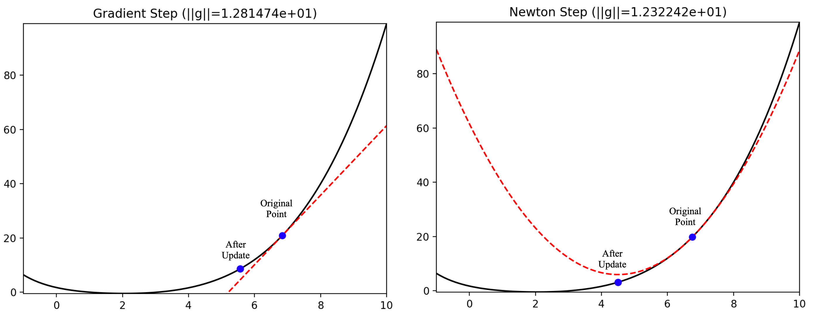
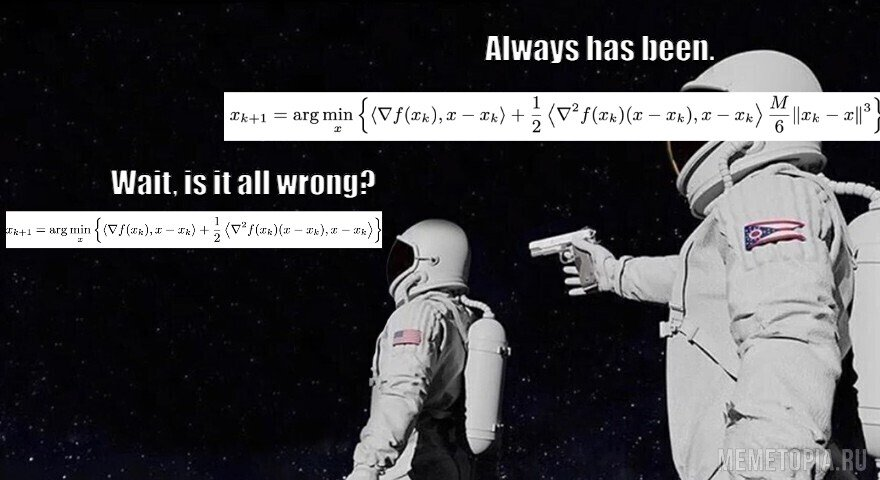

# Lecture recap
## First interpretation of Newton method (solution of linearized equations)

:::: {.columns}

::: {.column width="60%"}

:::

::: {.column width="40%"}
Consider the function $\varphi(x): \mathbb{R} \to \mathbb{R}$. 
We want to find the root of $\varphi(x) = 0$.

The whole idea came from building a linear approximation at the point $x_k$ and find its root, which will be the new iteration point:

$$
\varphi'(x_k) = \frac{\varphi(x_k)}{x_{k+1} - x_k}
$$

We get an iterative scheme:
$$
x_{k+1} = x_k - \dfrac{\varphi(x_k)}{\varphi'(x_k)}.
$$

Now, if we consider $\varphi(x) \equiv \nabla f(x)$, this will become a Newton optimization method:

$$
x_{k+1} = x_k - \left[ \nabla^2 f(x_k)\right]^{-1} \nabla f(x_k)
$$
:::

::::

## Example of Newton linearization method

::: {.callout-question title="Newton method"}
Apply Newton method to find the root of $\varphi(t)=0$ and determine the convergence area:

$$
\varphi(t) = \dfrac{t}{\sqrt{1 + t^2}}
$$
::: 

. . .

1. Let's find the derivative:
$$
\varphi^{\prime}(t) = - \dfrac{t^2}{(1 + t^2)^{\frac{3}{2}}} + \dfrac{1}{\sqrt{1 + t^2}}
$$

. . .

2. Then the iteration of the method takes the form:

$$
x_{k+1} = x_k - \dfrac{\varphi(x_k)}{\varphi'(x_k)} = x_k - x_k(x_k^2 + 1) = - x_k^3
$$

. . .

::: {.callout-important icon="false" appearance="simple"}

It is easy to see that the method converges only if $|x_0| < 1$, emphasizing the **local** nature of the Newton method.

:::

## Second interpretation of Newton method (local quadratic Taylor approximation minimizer)

Let us now have the function $f(x)$ and a certain point $x_k$. Let us consider the quadratic approximation of this function near $x_k$:
$$
f^{II}_{x_k}(x) = f(x_k) + \langle \nabla f(x_k), x - x_k\rangle + \frac{1}{2} \langle \nabla^2 f(x_k)(x-x_k), x-x_k \rangle. 
$$

. . .

The idea of the method is to find the point $x_{k+1}$, that minimizes the function $f^{II}(x)$, i.e. $\nabla f^{II}(x_{k+1}) = 0$.
$$
\begin{aligned}
x_{k + 1} &= \arg \min_x \left\{f(x_k) + \langle \nabla f(x_k), x - x_k \rangle + \frac{1}{2} \left\langle\nabla^2 f(x_k) (x - x_k), x - x_k\right\rangle \right\} \\
\nabla f^{II}_{x_k}(x_{k+1})  &= \nabla f(x_{k}) + \nabla^2 f(x_k)(x_{k+1} - x_k) = 0 \\
\nabla^2 f(x_k)(x_{k+1} - x_k) &= -\nabla f(x_{k}) \\
\left[ \nabla^2 f(x_k)\right]^{-1} \nabla^2 f(x_k)(x_{k+1} - x_k) &= -\left[ \nabla^2 f(x_k)\right]^{-1} \nabla f(x_{k}) \\
x_{k+1} &= x_k -\left[ \nabla^2 f(x_k)\right]^{-1} \nabla f(x_{k}).
\end{aligned}
$$

. . .

::: {.callout-important icon="false" appearance="simple"}
Pay attention to the restrictions related to the need for the Hessian to be non-degenerate (for the method to work), as well as for it to be positive definite (for convergence guarantee).
:::

## Newton method as a local quadratic Taylor approximation minimizer

## Newton method as a local quadratic Taylor approximation minimizer {.noframenumbering}

## Newton method as a local quadratic Taylor approximation minimizer {.noframenumbering}

## Newton method as a local quadratic Taylor approximation minimizer {.noframenumbering}

## Newton method as a local quadratic Taylor approximation minimizer {.noframenumbering}

## Newton method as a local quadratic Taylor approximation minimizer {.noframenumbering}

## Newton method vs gradient descent

{width=80% fig-align="center"}

::: {.callout-tip icon="false" appearance="simple"}

$$
\begin{aligned}
\text{The gradient descent} &\equiv \text{linear approximation} \\
\text{The Newton method} &\equiv \text{quadratic approximation}
\end{aligned}
$$

:::

## Convergence

:::{.callout-theorem}
Let $f(x)$ be a strongly convex twice continuously differentiable function at $\mathbb{R}^n$, for the second derivative of which inequalities are executed: $\mu I_n\preceq \nabla^2 f(x) \preceq L I_n$. Then Newton method with a constant step 

$$
x_{k+1} = x_k -\left[ \nabla^2 f(x_k)\right]^{-1} \nabla f(x_{k})
$$

locally converges to solving the problem with superlinear speed. If, in addition, Hessian is $M$-Lipschitz continuous, then this method converges locally to $x^*$ at a quadratic rate:

$$
\left\|x_{k+1}-x^*\right\|_2 \leq \frac{M\left\|x_k-x^*\right\|_2^2}{2\left(\mu - M\left\|x_k-x^*\right\|_2\right)}
$$

:::

. . .

::: {.callout-tip icon="false" appearance="simple"}

"**Converge locally**" means that the convergence rate described above is guaranteed to occur only if the starting point is quite close to the minimum point, in particular $\| x_0 - x^* \| < \frac{2 \mu}{3M}$

:::

## Affine invariance

::: {.callout-question title="Affine invariance"}
Consider a function $f(x)$ and a transformation with an invertible matrix $A$. Let's figure out how the iteration step of Newton method will change after applying the transformation.
::: 

. . .

1. Let's $x=A y$ and $g(y)=f(A y)$. 

. . .

2. Consider a quadratic approximation:
$$
g(y+u) \approx g(y)+\left\langle g^{\prime}(y), u\right\rangle+\frac{1}{2} u^{\top} g^{\prime \prime}(y) u \rightarrow \min _u
$$
$$
u^*=-\left(g^{\prime \prime}(y)\right)^{-1} g^{\prime}(y) \quad y_{k+1}=y_k-\left(g^{\prime \prime}\left(y_k\right)\right)^{-1} g^{\prime}\left(y_k\right)
$$

. . .

3. Substitute explicit expressions for $g^{\prime \prime}\left(y_k\right), g^{\prime}\left(y_k\right)$:
$$
y_{k+1} = y_k-\left(A^{\top} f^{\prime \prime}\left(A y_k\right) A\right)^{-1} A^{\top} f^{\prime}\left(A y_k\right) = y_k-A^{-1}\left(f^{\prime \prime}\left(A y_k\right)\right)^{-1} f^{\prime}\left(A y_k\right)
$$

. . .

4. Thus, the method's step is transformed by linear transformation in **the same way** as the coordinates:
$$
A y_{k+1}=A y_k-\left(f^{\prime \prime}\left(A y_k\right)\right)^{-1} f^{\prime}\left(A y_k\right) \quad x_{k+1}=x_k-\left(f^{\prime \prime}\left(x_k\right)\right)^{-1} f^{\prime}\left(x_k\right)
$$

## Summary of Newton method

::: {.callout-tip icon="false" title="Pros"}
- quadratic convergence near the solution
- high accuracy of the obtained solution
- affine invariance
:::

. . .

::: {.callout-important icon="false" title="Cons"}
- no global convergence
- it is necessary to store the hessian on each iteration: $\mathcal{O}(n^2)$ memory
- it is necessary to solve linear systems: $\mathcal{O}(n^3)$ operations
- the Hessian can be degenerate
- the Hessian may not be positively determined $\to$ direction $-(f^{\prime \prime}(x))^{-1}f^{\prime}(x)$ may not be a descending direction [\faEye](https://fmin.xyz/docs/methods/adaptive_metrics/newton_field.mp4)
:::

. . .

$$
\text{Cubic-regularized Newton method and Quasi Newton methods partially solve these problems!}
$$

# Cubic-regularized Newton method
## A bit of base.

## Intuition on how to improve Newton method

::: {.callout-tip title="Gradient Descent recap"}
If $f$ has $L$-Lipschitz gradient, then 
$$
    f(y) \le f(x) + \left\langle\nabla f(x), y - x\right\rangle + \frac{L}{2} \left\|y - x\right\|^{2}.
$$
So, each step of gradient descent for function $f$ with $L$-Lipschitz gradient is a minimization of majorizing paraboloid:
$$
    \begin{aligned}
        x_{k + 1} 
        &= \arg \min_x \left\{f(x_k) + \left\langle\nabla f(x_k), x - x_k\right\rangle + \frac{L}{2} \left\|x - x_k\right\|^2\right\} \\
        &= x_k - \frac{1}{L} \nabla f(x_k).
    \end{aligned}
$$
:::

. . .

But if function $f$ has $M$-Lipschitz Hessian, it is easy to show that 
$$
    f(y) \le f(x) + \left\langle\nabla f(x), y - x\right\rangle + \frac{1}{2} \left\langle\nabla^{2} f(x)(y - x), y - x\right\rangle + \frac{M}{6} \left\|y - x\right\|^{3}.
$$

\textbf{What if we use the same logic as in gradient descent for function with $M$-Lipschitz Hessian?}

## Cubic-regularized Newton method

If $f$ has $M$-Lipschitz Hessian, then 
$$
    f(y) \le f(x) + \left\langle\nabla f(x), y - x\right\rangle + \frac{1}{2} \left\langle\nabla^{2} f(x)(y - x), y - x\right\rangle + \frac{M}{6} \left\|y - x\right\|^{3}.
$$
Minimizing the right-hand side of this inequality, we come to Cubic-regularized Newton method
\begin{equation}\label{eq:cubreg}
    x_{k + 1} = \arg \min_x \left\{f(x_k) + \left\langle\nabla f(x_k), x - x_k\right\rangle + \frac{1}{2} \left\langle\nabla^{2} f(x_k)(x - x_k), x - x_k\right\rangle + \frac{M}{6} \left\|x - x_k\right\|^{3} \right\}. 
\end{equation}

\only<1>{
\begin{block}{Question}
What problems do you see in \eqref{eq:cubreg}?
\end{block}
}

. . .

<!-- ## Cubic-regularized Newton method

If $f$ has $M$-Lipschitz Hessian, then 
$$
    f(y) \le f(x) + \left\langle\nabla f(x), y - x\right\rangle + \frac{1}{2} \left\langle\nabla^{2} f(x)(y - x), y - x\right\rangle + \frac{M}{6} \left\|y - x\right\|^{3}.
$$
Minimizing the right-hand side of this inequality, we come to Cubic-regularized Newton method
\begin{equation}\label{eq:cubreg}
    x_{k + 1} = \arg \min_x \left\{f(x_k) + \left\langle\nabla f(x_k), x - x_k\right\rangle + \frac{1}{2} \left\langle\nabla^{2} f(x_k)(x - x_k), x - x_k\right\rangle + \frac{M}{6} \left\|x - x_k\right\|^{3} \right\}. 
\end{equation}
 -->

::: {.callout-important title="Challenges"}
1. We can't get explicit expression for $x_{k + 1}$ (without argmin) from \eqref{eq:cubreg} as we could in gradient descent.
2. The subproblem inside \eqref{eq:cubreg} can be non-convex.
:::

. . .

::: {.callout-tip title="Solutions"}
1. We can use numerical methods with fast convergence
2. The subproblem is equivalent to a convex one-dimensional optimization problem. \footnote{\href{https://www.math.pku.edu.cn/amel/docs/20240417092720821855.pdf}{Nesterov, Y. (2018). Lectures on convex optimization. Springer.}}
3. The subproblem can be made convex with proper regularization coefficient. \footnote{\href{https://link.springer.com/content/pdf/10.1007/s10107-019-01449-1.pdf}{Nesterov, Y. (2021). Implementable tensor methods in unconstrained convex optimization. Mathematical Programming.}}
:::

<!-- {.noframenumbering} -->

## Convergence \footnote{\href{https://arxiv.org/pdf/2410.04083}{Kamzolov, D., et al. (2024). Optami: Global superlinear convergence of high-order methods. Accepted to ICLR 2025.}}

::: {.callout-theorem}
Let $f(x)$ be $\mu$-strongly convex function with $M$-Lipschitz Hessian.
Then, Cubic-regularized Newton Method \eqref{eq:cubreg} converges globally superlinearly as
$$
    f(x_{k + 1}) - f^* \le \gamma_k (f(x_k) - f^{*}),\ \gamma_k \to 0. 
$$
:::

# Quasi Newton methods
## Quasi-Newton methods intuition

For the classic task of unconditional optimization $f(x) \to \min\limits_{x \in \mathbb{R}^n}$ the general scheme of iteration method is written as: 
$$
x_{k+1} = x_k + \alpha_k d_k
$$

. . .

In the Newton method, the $d_k$ direction (Newton direction) is set by the linear system solution at each step:
$$
B_k d_k = - \nabla f(x_k), \;\;\; B_k = \nabla^2 f(x_k)
$$

. . .

i.e. at each iteration it is necessary to **compute** hessian and gradient and **solve** linear system.

. . .

Note here that if we take a single matrix of $B_k = I_n$ as $B_k$ at each step, we will exactly get the gradient descent method.

The general scheme of quasi-Newton methods is based on the selection of the $B_k$ matrix so that it tends in some sense at $k \to \infty$ to the truth value of the Hessian $\nabla^2 f(x_k)$. 

## Quasi-Newton method Template

Let $x_{0} \in \mathbb{R}^n$, $B_{0} \succ 0$. For $k = 1, 2, 3, \dots$, repeat: 

1. Find $d_k: B_{k} d_{k} = -\nabla f(x_{k})$
2. Update $x_{k+1} = x_{k} + \alpha_k d_{k}$
3. Compute $B_{k+1}$ from $B_{k}$

. . .

Different quasi-Newton methods implement Step 3 differently. As we will see, commonly we can compute $(B_{k+1})^{-1}$ from $(B_{k})^{-1}$.

. . .

**Basic Idea:** As $B_{k}$ already contains information about the Hessian, use a suitable matrix update to form $B_{k+1}$.

. . .

**Reasonable Requirement for $B_{k+1}$** (motivated by the secant method): 
$$
\begin{aligned}
\nabla f(x_{k+1}) - \nabla f(x_{k}) &= B_{k+1} (x_{k+1} - x_k) =  B_{k+1} d_{k} \\
\Delta y_k &= B_{k+1} d_k
\end{aligned}
$$

. . .

In addition to the secant equation, we want: 

* $B_{k+1}$ to be symmetric
* $B_{k+1}$ to be “close” to $B_k$
* $B_k \succ 0 \Rightarrow B_{k+1} \succ 0$

## Problem 1: Symmetric Rank-One (SR1) update

Let's try an update with rank-one matrix:
$$
B_{k+1} = B_k + a u u^T
$$

<!-- The secant equation $B_{k+1} d_k = \Delta y_k$ yields:
$$
(a u^T d_k) u = \Delta y_k - B_k d_k
$$ -->

::: {.callout-question }
What $a$ and $u$ can we choose? How the update of the $B_{k + 1}$ would look like? 
:::

. . . 

<!-- This only holds if $u$ is collinear to $\Delta y_k - B_k d_k$. Putting $u = \Delta y_k - B_k d_k$, we solve the above, 
$$
a = \frac{1}{(\Delta y_k - B_k d_k)^T d_k},
$$ 

. . .

which leads to  -->

## SR1 convergence

$$
B_{k+1} = B_k +  \frac{(\Delta y_k - B_k d_k)(\Delta y_k - B_k d_k)^T}{(\Delta y_k - B_k d_k)^T d_k}
$$

called the symmetric rank-one (SR1) update or Broyden method.

::: {.callout-theorem}
Let 

- $f$ be twice continuously differentiable, has unique stationary point $x^*$,
- $0 \succ \nabla^2 f(x^{2})$, $\nabla^{2} f(x)$ is Lipschitz continuous in a neighborhood $x^*$,
- the sequence of matrices $\{B_k\}$ is bounded in norm,
- $|(\Delta y_k - B_k d_k)^T d_k | \ge r \left\|d_k\right\| \left\|\Delta y_k - B_k d_k\right\|,\ 0 < r \ll 1$.

Then in SR1 $x_k \to x^*$ superlinearly.
:::

## SR1 with inverse update

How can we solve 
$$
B_{k+1} d_{k+1} = -\nabla f(x_{k+1}),
$$ 
in order to take the next step? 
In addition to propagating $B_k$ to $B_{k+1}$, let's propagate inverses, i.e., $C_k = B_k^{-1}$ to $C_{k+1} = (B_{k+1})^{-1}$.

### Sherman-Morrison Formula:
The Sherman-Morrison formula states:

$$
(A + uv^T)^{-1} = A^{-1} - \frac{A^{-1}uv^T A^{-1}}{1 + v^T A^{-1}u}
$$

<!-- ::: {.callout-question}
How the update for $C_{k + 1}$ would look like?
::: -->

. . .

Thus, for the SR1 update, the inverse is also easily updated:

$$
C_{k+1} = C_k + \frac{(d_k - C_k \Delta y_k)(d_k - C_k \Delta y_k)^T}{(d_k - C_k \Delta y_k)^T \Delta y_k}
$$
In general, SR1 is simple and cheap, but it has a key drawback: it does not preserve positive definiteness.

<!-- ## Davidon-Fletcher-Powell update

We could have pursued the same idea to update the inverse $C$: 
$$
C_{k+1} = C_k + a u u^T + b v v^T.
$$

. . .

Multiplying by $\Delta y_k$, using the secant equation $d_k = C_k \Delta y_k$, and solving for $a$, $b$, yields:

$$
C_{k+1} = C_k - \frac{C_k \Delta y_k \Delta y_k^T C_k}{\Delta y_k^T C_k \Delta y_k} + \frac{d_k d_k^T}{\Delta y_k^T d_k}
$$

### Woodbury Formula Application
Woodbury then shows:

$$
B_{k+1} = \left(I - \frac{\Delta y_k d_k^T}{\Delta y_k^T d_k}\right)B_k\left(I - \frac{d_k \Delta y_k^T}{\Delta y_k^T d_k}\right) + \frac{\Delta y_k \Delta y_k^T}{\Delta y_k^T d_k}
$$

This is the Davidon-Fletcher-Powell (DFP) update. Also cheap: $O(n^2)$, preserves positive definiteness. Not as popular as BFGS. -->

## Problem 2: Broyden-Fletcher-Goldfarb-Shanno (BFGS) update

Let's now try a rank-two update:
$$
B_{k+1} = B_k + a u u^T + b v v^T.
$$

::: {.callout-question }
What $a$, $u$, $b$ and $v$ can we choose? How the update of the $B_{k + 1}$ would look like? 
:::

<!-- . . .

The secant equation $\Delta y_k = B_{k+1} d_k$ yields:
$$
\Delta y_k - B_k d_k = (a u^T d_k) u + (b v^T d_k) v
$$

. . .

Putting $u = \Delta y_k$, $v = B_k d_k$, and solving for a, b we get: -->

## BFGS convergence

$$
B_{k+1} = B_k - \frac{B_k d_k d_k^T B_k}{d_k^T B_k d_k} + \frac{\Delta y_k \Delta y_k^T}{d_k^T \Delta y_k}
$$
called the Broyden-Fletcher-Goldfarb-Shanno (BFGS) update.

::: {.callout-theorem}
Let $f(x)$ be twice continuously differentiable, have Lipschitz Hessian at $x^*$ and additionally $\sum_{k = 1}^\infty \| x_k - x^* \| \le \infty$.
Then in BFGS $x_k \to x^*$ superlinearly. 
:::

## BFGS update with inverse

### Woodbury Formula

The Woodbury formula, a generalization of the Sherman-Morrison formula, is given by:
$$
(A + UCV)^{-1} = A^{-1} - A^{-1}U(C^{-1} + V A^{-1}U)^{-1}V A^{-1}
$$

. . .

Applied to our case, we get a rank-two update on the inverse $C$:
$$
C_{k+1} = C_k + \frac{(d_k - C_k \Delta y_k) d_k^T}{\Delta y_k^T d_k} + \frac{d_k (d_k - C_k \Delta y_k)^T}{\Delta y_k^T d_k} - \frac{(d_k - C_k \Delta y_k)^T \Delta y_k}{(\Delta y_k^T d_k)^2} d_k d_k^T
$$

$$
C_{k+1} = \left(I - \frac{d_k \Delta y_k^T}{\Delta y_k^T d_k}\right) C_k \left(I - \frac{\Delta y_k d_k^T}{\Delta y_k^T d_k}\right) + \frac{d_k d_k^T}{\Delta y_k^T d_k}
$$

This formulation ensures that the BFGS update, while comprehensive, remains computationally efficient, requiring $O(n^2)$ operations. Importantly, BFGS update preserves positive definiteness. Recall this means $B_k \succ 0 \Rightarrow B_{k+1} \succ 0.$ Equivalently, $C_k \succ 0 \Rightarrow C_{k+1} \succ 0$

## L-BFGS main idea

- L-BFGS does not store full matrix $B_k$ ($C_k$), instead it stores two sequences of vectors of length $m: m < n$
- memory reduces from $O(n^2)$ to $O(mn)$, making it more sutable for high-dimensional problems

<!-- ## Quasi Newton methods

For the classic task of unconditional optimization $f(x) \to \min\limits_{x \in \mathbb{R}^n}$ the general scheme of iteration method is written as:
$$
x_{k+1} = x_k + \alpha_k s_k
$$
In the Newton method, the $s_k$ direction (Newton’s direction) is set by the linear system solution at each step:

$$
s_k = - B_k\nabla f(x_k), \;\;\; B_k = f_{xx}^{-1}(x_k)
$$

Note here that if we take a single matrix of $B_k = I_n$ as $B_k$ at each step, we will exactly get the gradient descent method.
. . .

::: {.callout-tip icon="false" appearance="simple"}
The general scheme of quasi-Newton methods is based on the selection of the $B_k$ matrix so that it tends in some sense at $k \to \infty$ to the true value of inverted Hessian in the local optimum $f_{xx}^{-1}(x_*)$. 
:::

## Quasi Newton methods
Let’s consider several schemes using iterative updating of $B_k$ matrix in the following way: 
$$
B_{k+1} = B_k + \Delta B_k
$$
Then if we use Taylor’s approximation for the first order gradient, we get it:
$$
\nabla f(x_k) - \nabla f(x_{k+1}) \approx f_{xx}(x_{k+1}) (x_k - x_{k+1}).
$$
Now let’s formulate our method as:
$$
\Delta x_k = B_{k+1} \Delta y_k, \text{ where } \;\; \Delta y_k = \nabla f(x_{k+1}) - \nabla f(x_k)
$$
in case you set the task of finding an update $\Delta B_k$:
$$
\Delta B_k \Delta y_k = \Delta x_k - B_k \Delta y_k
$$

## Broyden method

The simplest option is when the amendment $\Delta B_k$ has a rank equal to one. Then you can look for an amendment in the form
$$
\Delta B_k = \mu_k q_k q_k^\top.
$$
where $\mu_k$ is a scalar and $q_k$ is a non-zero vector. Then mark the right side of the equation to find $\Delta B_k$ for $\Delta z_k$:
$$
\Delta z_k = \Delta x_k - B_k \Delta y_k
$$
We get it:
$$
\mu_k q_k q_k^\top \Delta y_k = \Delta z_k
$$
$$
\left(\mu_k \cdot q_k^\top \Delta y_k\right) q_k = \Delta z_k
$$
A possible solution is: $q_k = \Delta z_k$, $\mu_k = \left(q_k^\top \Delta y_k\right)^{-1}$.
Then an iterative amendment to Hessian’s evaluation at each iteration:
$$
\Delta B_k = \dfrac{(\Delta x_k - B_k \Delta y_k)(\Delta x_k - B_k \Delta y_k)^\top}{\langle \Delta x_k - B_k \Delta y_k , \Delta y_k\rangle}.
$$

## Davidon–Fletcher–Powell method

$$
\Delta B_k = \mu_1 \Delta x_k (\Delta x_k)^\top + \mu_2 B_k \Delta y_k (B_k \Delta y_k)^\top.
$$
$$
\Delta B_k = \dfrac{(\Delta x_k)(\Delta x_k )^\top}{\langle \Delta x_k , \Delta y_k\rangle} - \dfrac{(B_k \Delta y_k)( B_k \Delta y_k)^\top}{\langle B_k \Delta y_k , \Delta y_k\rangle}.
$$

## Broyden–Fletcher–Goldfarb–Shanno method

$$
\Delta B_k = Q U Q^\top, \quad Q = [q_1, q_2], \quad q_1, q_2 \in \mathbb{R}^n, \quad U = \begin{pmatrix} a & c\\ c & b \end{pmatrix}.
$$
$$
\Delta B_k = \dfrac{(\Delta x_k)(\Delta x_k )^\top}{\langle \Delta x_k , \Delta y_k\rangle} - \dfrac{(B_k \Delta y_k)( B_k \Delta y_k)^\top}{\langle B_k \Delta y_k , \Delta y_k\rangle} + p_k p_k^\top.
$$ -->

# Computational experiments
## Computational experiments

- Computation experiments for Quasi-Newtom, CG and GD [\faPython](https://colab.research.google.com/github/MerkulovDaniil/hse25/blob/main/notebooks/s11_quasinewton_cg_gd.ipynb)
- Computational experiments for Newton and Quasi Newton methods [\faGithub](https://github.com/amkatrutsa/optimization_course/blob/master/Spring2022/newton_quasi.ipynb).

<!-- # Check

$$
\begin{gathered}
x_{k + 1} = \arg \min_x \left\{\langle \nabla f(x_k), x - x_k \rangle + \frac{1}{2} \left\langle\nabla^2 f(x_k) (x - x_k), x - x_k\right\rangle \right\} 
\end{gathered}
$$

$$
\begin{gathered}
x_{k + 1} = \arg \min_x \left\{\langle \nabla f(x_k), x - x_k \rangle + \frac{1}{2} \left\langle\nabla^2 f(x_k) (x - x_k), x - x_k\right\rangle \frac{M}{6} \|x_k - x\|^3 \right\}.
\end{gathered}
$$ -->