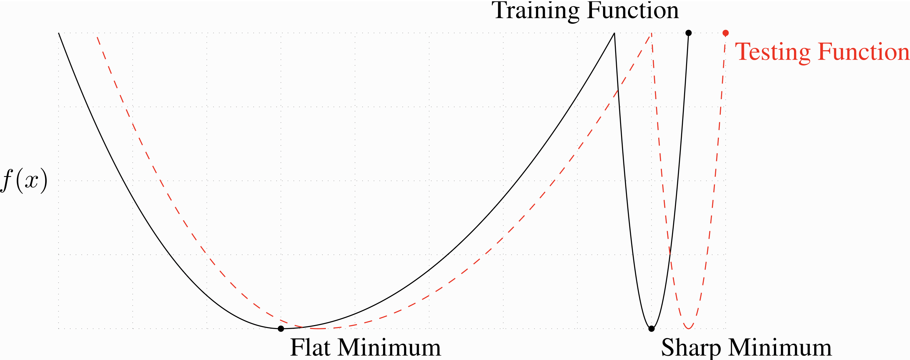
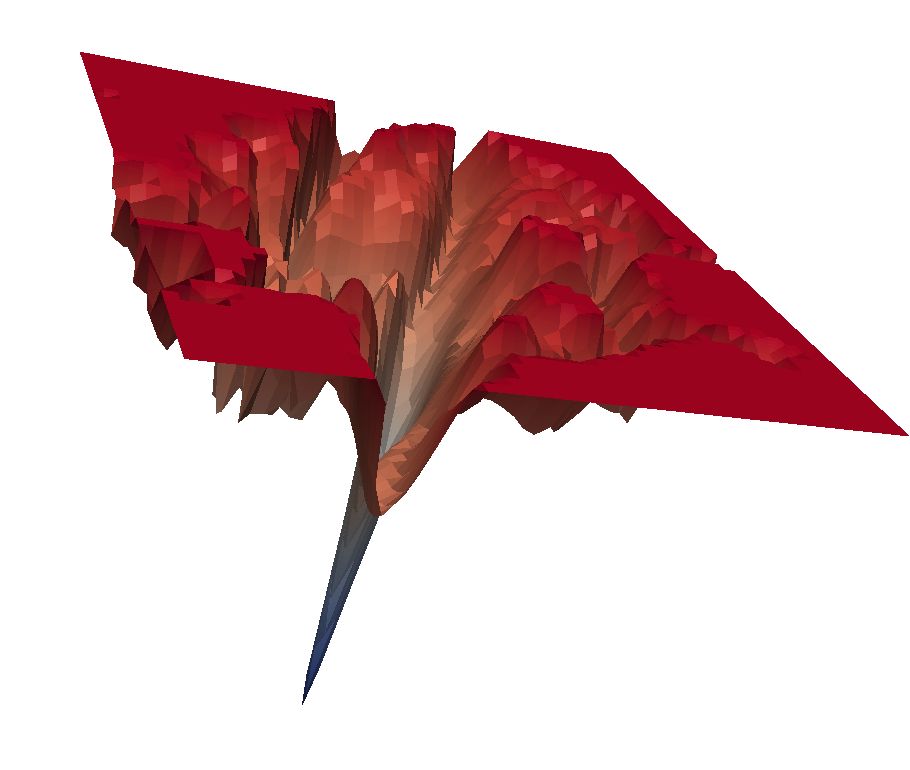
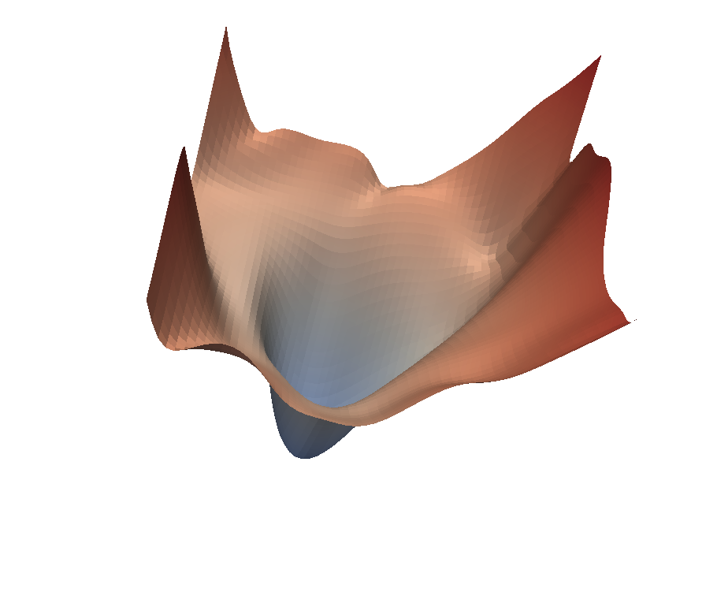
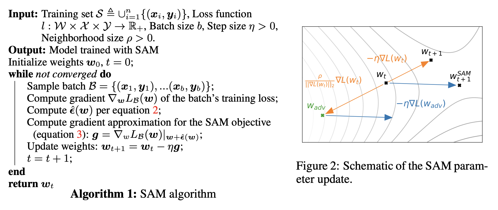
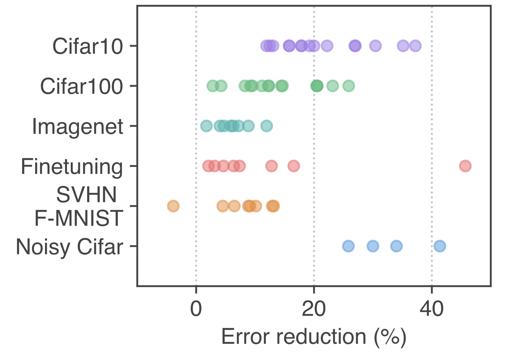
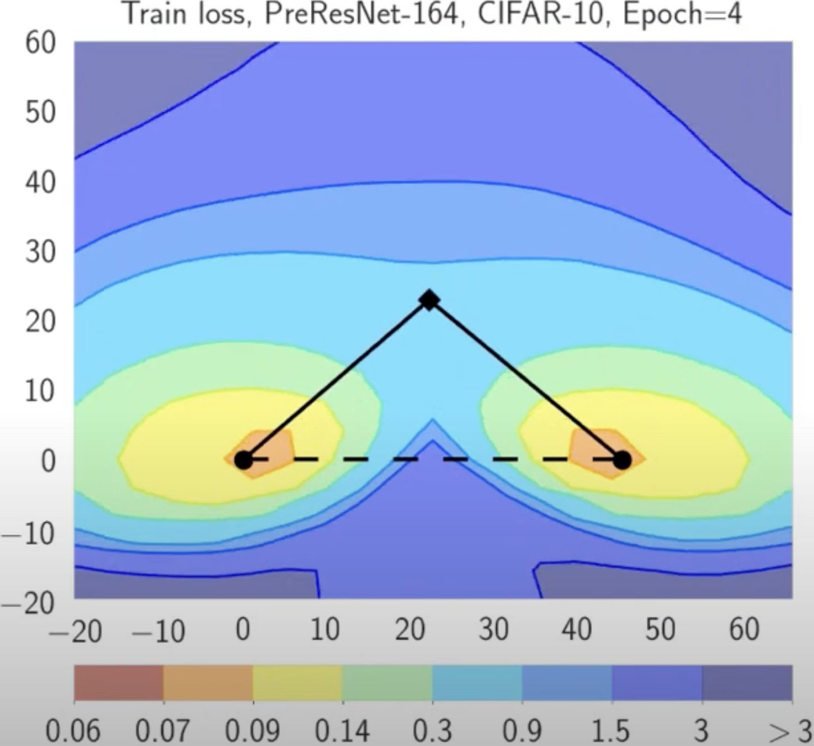
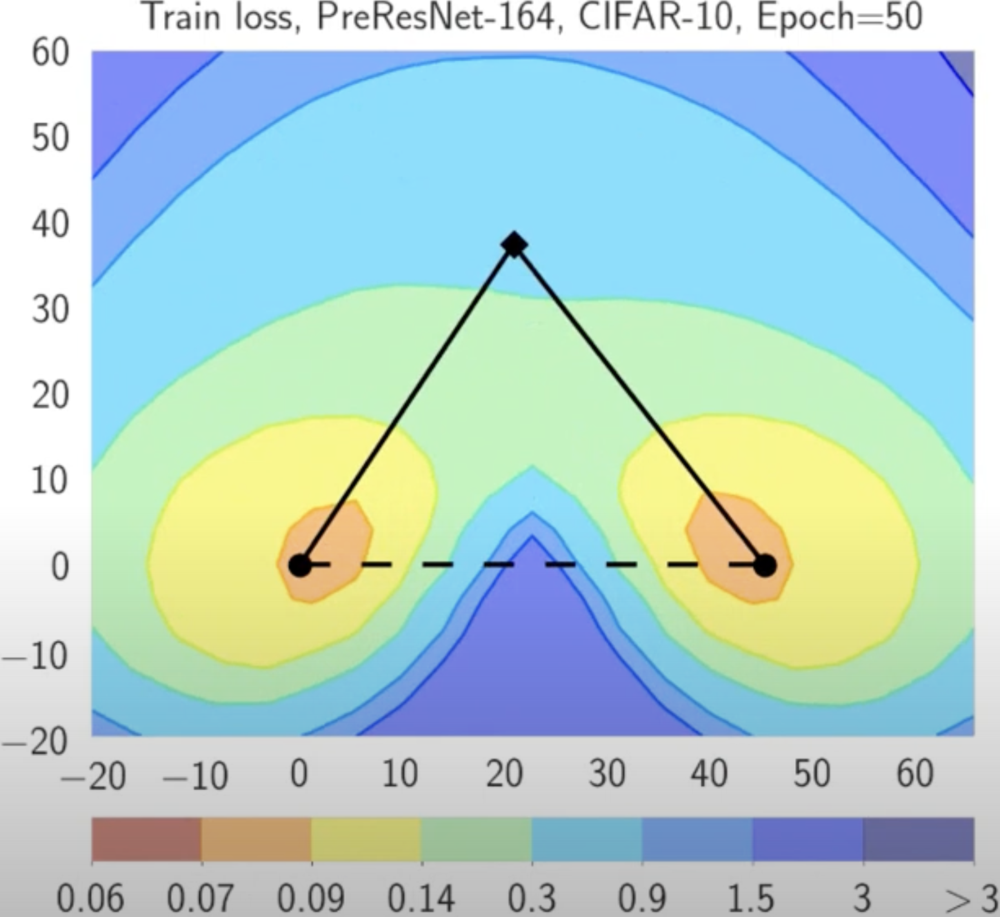
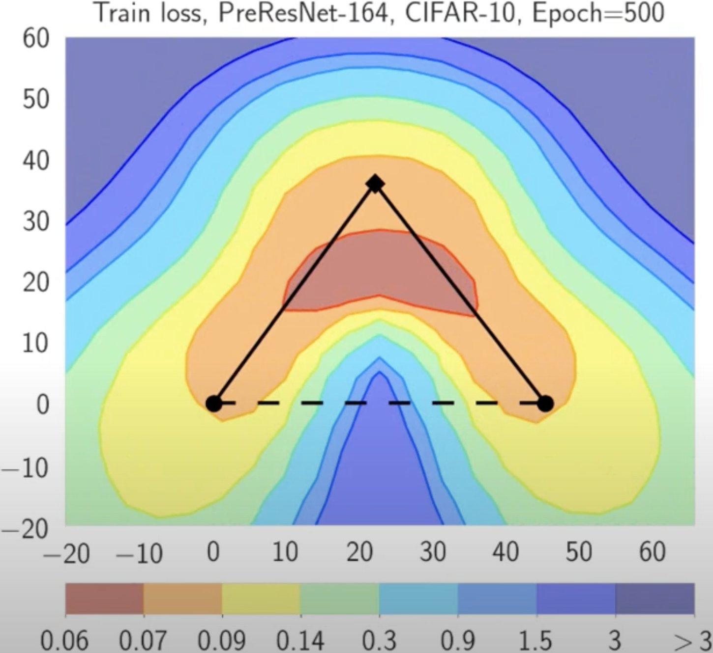
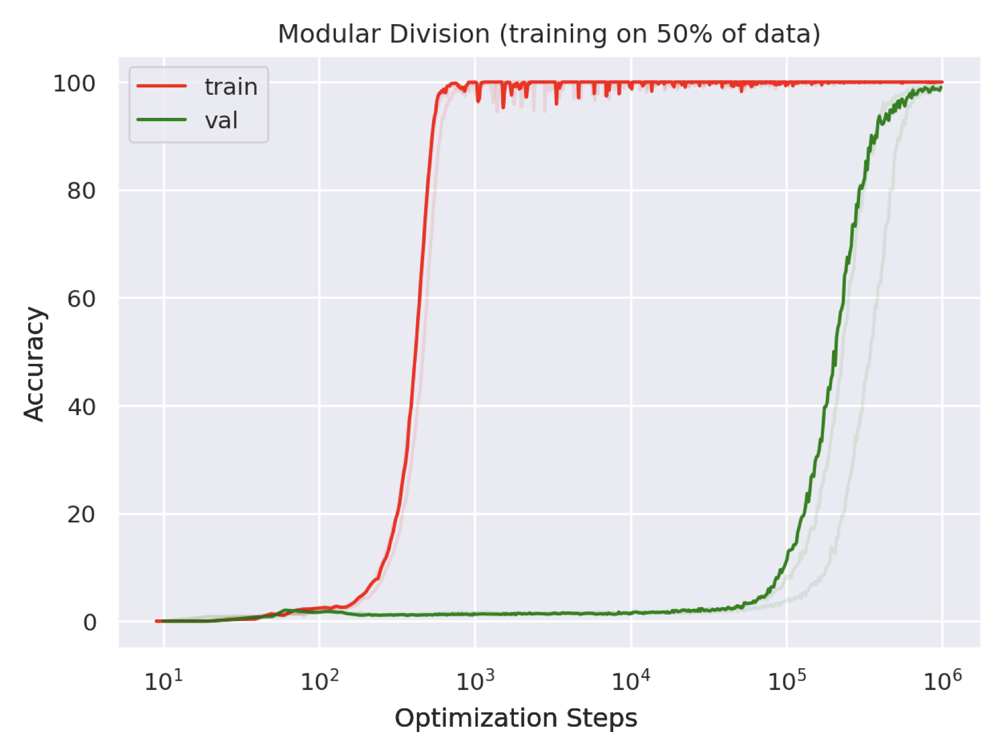

# Задача конечной суммы

## Задача конечной суммы

Рассмотрим классическую задачу минимизации среднего на конечной выборке:
$$
\min_{x \in \mathbb{R}^p} f(x) = \min_{x \in \mathbb{R}^p}\frac{1}{n} \sum_{i=1}^n f_i(x)
$$

Градиентный спуск действует следующим образом:
$$
\tag{GD}
x_{k+1} = x_k - \frac{\alpha_k}{n} \sum_{i=1}^n \nabla f_i(x)
$$

. . .

* Сходимость с постоянным $\alpha$ или линейным поиском.
* Стоимость итерации линейна по $n$. Для ImageNet $n\approx 1.4 \cdot 10^7$, для WikiText $n \approx 10^8$.

. . .

Перейдем от вычисления полного градиента к его несмещенной оценке, когда мы случайно выбираем индекс $i_k$ точки на каждой итерации равномерно:
$$
\tag{SGD}
x_{k+1} = x_k - \alpha_k  \nabla f_{i_k}(x_k)
$$
При $p(i_k = i) = \frac{1}{n}$ стохастический градиент является несмещенной оценкой градиента, определяемой как:
$$
\mathbb{E}[\nabla f_{i_k}(x)] = \sum_{i=1}^{n} p(i_k = i) \nabla f_i(x) = \sum_{i=1}^{n} \frac{1}{n} \nabla f_i(x) = \frac{1}{n} \sum_{i=1}^{n} \nabla f_i(x) = \nabla f(x)
$$
Это указывает на то, что математическое ожидание стохастического градиента равно фактическому градиенту $f(x)$.

## Результаты для градиентного спуска

Стохастические итерации в $n$ раз быстрее, но сколько итераций требуется?

. . .

Если $\nabla f$ является Липшицевым, то мы имеем:

| Предположение | Детерминированный градиентный спуск | Стохастический градиентный спуск |
|:----------:|:--------------------------------:|:-----------------------------:|
| PL           | $O(\log(1/\varepsilon))$       | $O(1/\varepsilon)$          |
| Выпуклая       | $O(1/\varepsilon)$             | $O(1/\varepsilon^2)$           |
| Невыпуклая   | $O(1/\varepsilon)$             | $O(1/\varepsilon^2)$        |

. . .

* Стохастический метод имеет низкую стоимость итерации, но медленную скорость сходимости. 
  * Сублинейная скорость даже в сильно выпуклом случае.
  * Оценки неулучшаемы при стандартных предположениях.
  * Оракул возвращает несмещенную аппроксимацию градиента с ограниченной дисперсией.
    
* Momentum и квазиньютоновские методы не улучшают скорость сходимости в стохастическом случае. Могут улучшить только константы (узким местом является дисперсия, а не число обусловленности).

# Стохастический градиентный спуск (SGD)

## Типичное поведение

{width=90%}

# Вычислительные эксперименты

## Вычислительные эксперименты

[Визуализация SGD](https://fa.bianp.net/teaching/2018/eecs227at/stochastic_gradient.html). 

Посмотрим на вычислительные эксперименты для SGD [\faPython](https://colab.research.google.com/drive/1ITm0mHXq_1UyoIt18gULukLdBbtrCYt_?usp=sharing).

# Адаптивность или масштабирование

## Adagrad (Duchi, Hazan, and Singer 2010/Streeter and MacMahan 2010)

Очень популярный адаптивный метод. Пусть $g^{(k)} = \nabla f_{i_k}(x^{(k-1)})$, и обновление для $j = 1, \dots, p$:

$$
v^{(k)}_j = v^{k-1}_j + (g_j^{(k)})^2
$$
$$
x_j^{(k)} = x_j^{(k-1)} - \alpha \frac{g_j^{(k)}}{\sqrt{v^{(k)}_j  + \epsilon}}
$$

. . .

**Заметки:**

* AdaGrad не требует настройки скорости обучения: $\alpha > 0$ — фиксированная константа, и скорость обучения естественным образом уменьшается с итерациями.
* Скорость обучения редких информативных признаков уменьшается медленно.
* Может значительно превосходить SGD в разреженных задачах.
* Основным недостатком является монотонное накопление градиентов в знаменателе. AdaDelta, Adam, AMSGrad и др. улучшают это, популярны при обучении глубоких нейронных сетей.
* Константа $\epsilon$ обычно устанавливается равной $10^{-6}$, чтобы избежать деления на ноль или слишком больших шагов.

## RMSProp (Tieleman and Hinton, 2012)

Улучшение AdaGrad, решающее проблему агрессивного, монотонно убывающего темпа обучения. Использует скользящее среднее квадратов градиентов для настройки скорости обучения для каждого веса. Пусть $g^{(k)} = \nabla f_{i_k}(x^{(k-1)})$ и правило обновления для $j = 1, \dots, p$:
$$
v^{(k)}_j = \gamma v^{(k-1)}_j + (1-\gamma) (g_j^{(k)})^2
$$
$$
x_j^{(k)} = x_j^{(k-1)} - \alpha \frac{g_j^{(k)}}{\sqrt{v^{(k)}_j + \epsilon}}
$$

. . .

**Заметки:**

* RMSProp делит скорость обучения для веса на скользящее среднее величин последних градиентов для этого веса.
* Позволяет более тонко настраивать скорость обучения, чем AdaGrad, что делает его подходящим для неизотропных задач.
* Часто используется при обучении нейронных сетей, особенно рекуррентных.

<!-- ## Adadelta (Zeiler, 2012)

Расширение RMSProp, направленное на уменьшение зависимости от вручную задаваемой глобальной скорости обучения. Вместо накопления всех прошлых квадратов градиентов, Adadelta ограничивает окно накопленных прошлых градиентов некоторым фиксированным размером $w$. Механизм обновления не требует скорости обучения $\alpha$:

$$
v^{(k)}_j = \gamma v^{(k-1)}_j + (1-\gamma) (g_j^{(k)})^2
$$
$$
\tilde{g}_j^{(k)} = \frac{\sqrt{{\Delta x_j^{(k-1)}} + \epsilon}}{\sqrt{v^{(k)}_j+ \epsilon}} g_j^{(k)}
$$
$$
x_j^{(k)} = x_j^{(k-1)} - \tilde{g}_j^{(k)}
$$
$$
\Delta x_j^{(k)} = \rho \Delta x_j^{(k-1)} + (1-\rho) (\tilde{g}_j^{(k)})^2
$$

. . .

**Заметки:**

* Adadelta адаптирует скорость обучения на основе скользящего окна обновлений градиента, а не накапливает все прошлые градиенты. Таким образом, настроенные скорости обучения более устойчивы к изменениям динамики модели.
* Метод не требует установки начальной скорости обучения, что упрощает настройку.
* Часто используется в глубоком обучении, где масштабы параметров значительно различаются по слоям. -->

## Adam (Kingma and Ba, 2014) ^[[Adam: A Method for Stochastic Optimization](https://arxiv.org/abs/1412.6980)] ^[[On the Convergence of Adam and Beyond](https://arxiv.org/abs/1904.09237)]

Сочетает в себе элементы как AdaGrad, так и RMSProp. Рассматривает экспоненциально затухающее среднее прошлых градиентов и квадратов градиентов.

::::{.columns}
:::{.column width="50%"}
\begin{tabular}{ll}
EMA: & $m_j^{(k)} = \beta_1 m_j^{(k-1)} + (1-\beta_1) g_j^{(k)}$ \\[1ex]
                           & $v_j^{(k)} = \beta_2 v_j^{(k-1)} + (1-\beta_2) \left(g_j^{(k)}\right)^2$ \\[1ex]
Исправление смещения:          & $\hat{m}_j = \dfrac{m_j^{(k)}}{1-\beta_1^k}$ \\[1ex]
                           & $\hat{v}_j = \dfrac{v_j^{(k)}}{1-\beta_2^k}$ \\[1ex]
Обновление:                   & $x_j^{(k)} = x_j^{(k-1)} - \alpha\,\dfrac{\hat{m}_j}{\sqrt{\hat{v}_j} + \epsilon}$ \\
\end{tabular}
:::

:::{.column width="45%"}

. . . 

**Заметки:**

* Он исправляет смещение к нулю в начальные моменты, наблюдаемое в других методах, таких как RMSProp, делая оценки более точными.
* Одна из самых цитируемых научных статей в мире
* В 2018-2019 годах были опубликованы статьи, указывающие на ошибки в оригинальной статье
* Не сходится на некоторых простых задачах (даже выпуклых)
* Каким-то образом работает исключительно хорошо для некоторых сложных задач
* Работает намного лучше для языковых моделей, чем для задач компьютерного зрения — почему?
:::
::::

## AdamW (Loshchilov & Hutter, 2017)

Решает распространенную проблему с $\ell_2$ регуляризацией в адаптивных оптимизаторах, таких как Adam. Стандартная $\ell_2$ регуляризация добавляет $\lambda \|x\|^2$ к функции потерь, что приводит к слагаемому градиента $\lambda x$. В Adam это слагаемое масштабируется адаптивной скоростью обучения $\left(\sqrt{\hat{v}_j} + \epsilon\right)$, связывая затухание весов с величинами градиента.

AdamW отделяет затухание весов от шага адаптации градиента.

Правило обновления:
$$
m_j^{(k)} = \beta_1 m_j^{(k-1)} + (1-\beta_1) g_j^{(k)}
$$
$$
v_j^{(k)} = \beta_2 v_j^{(k-1)} + (1-\beta_2) (g_j^{(k)})^2
$$
$$
\hat{m}_j = \frac{m_j^{(k)}}{1-\beta_1^k}, \quad \hat{v}_j = \frac{v_j^{(k)} }{1-\beta_2^k}
$$
$$
x_j^{(k)} = x_j^{(k-1)} - \alpha \left( \frac{\hat{m}_j}{\sqrt{\hat{v}_j} + \epsilon} + \lambda x_j^{(k-1)} \right)
$$

. . .

**Заметки:**

* Слагаемое затухания весов $\lambda x_j^{(k-1)}$ добавляется *после* шага адаптивного градиента.
* Широко применяется при обучении трансформеров и других больших моделей. Выбор по умолчанию для huggingface trainer.

## Shampoo \footnote{\href{https://arxiv.org/pdf/1802.09568}{Gupta, V., Koren, T. and Singer, Y., 2018, July. Shampoo: Preconditioned stochastic tensor optimization. In International Conference on Machine Learning (pp. 1842-1850). PMLR.
}}

Расшифровывается как **S**tochastic **H**essian-**A**pproximation **M**atrix **P**reconditioning for **O**ptimization **O**f deep networks. Это метод, вдохновленный оптимизацией второго порядка, разработанный для глубокого обучения больших моделей.

**Основная идея:** Аппроксимирует полноматричный предобуславливатель AdaGrad, используя эффективные матричные структуры, в частности произведения Кронекера.

Для матрицы весов $W \in \mathbb{R}^{m \times n}$ обновление включает предобуславливание с использованием аппроксимаций матриц статистики $L \approx \sum_k G_k G_k^T$ и $R \approx \sum_k G_k^T G_k$, где $G_k$ — градиенты.

Упрощенная концепция:

1. Вычислить градиент $G_k$.
2. Обновить статистики $L_k = \beta L_{k-1} + (1-\beta) G_k G_k^T$ и $R_k = \beta R_{k-1} + (1-\beta) G_k^T G_k$.
3. Вычислить предобуславливатели $P_L = L_k^{-1/4}$ и $P_R = R_k^{-1/4}$. (Обратный матричный корень)
4. Обновить: $W_{k+1} = W_k - \alpha P_L G_k P_R$.

. . .

**Заметки:**

* Нацелен на более эффективный учет информации о кривизне, чем методы первого порядка.
* Вычислительно дороже, чем Adam, но может сходиться быстрее или к лучшим решениям с точки зрения количества шагов.
* Требует тщательной реализации для эффективности (например, эффективное вычисление обратных матричных корней, работа с большими матрицами).
* Существуют варианты для различных форм тензоров (например, сверточных слоев).

# \faAtom \ Muon

## Новый подход к оптимизации ^[[KIMI K2: OPEN AGENTIC INTELLIGENCE](https://arxiv.org/pdf/2507.20534?)]

::::{.columns}
:::{.column width="50%"}
{width=100%, fig-align="center"}
:::
:::{.column width="50%"}
{width=100%, fig-align="center"}
:::
::::

Модели, отмеченные звёздочкой, были обучены методом Muon, остальные модели были обучены другими алгоритмами оптимизации.

## Интуиция за методом Muon ^[[Презентация R. Gower](https://docs.google.com/presentation/d/1KDjkaIa-7UyjacQSsuU88GdZh_UJTl2jT188Qzfnlek)]

\begin{center}
\fontsize{18pt}{22pt}\selectfont
$$
\min_{x \in \mathbb{R}^p} \tikznode{func}{f(x)}
$$
\vspace{0.5cm}
$$
f(x) = \tikznode{linear}{f(\tikznode{wk}{x_k}) + \langle \nabla f(x_k), x - x_k \rangle} + \tikznode{bigo}{\mathcal{O}(\|x - x_k\|_2^2)}.
$$
\end{center}

\begin{tikzpicture}[remember picture, overlay]
    \tikzset{
        box/.style={draw=blue!50!black, rounded corners, very thick, align=center, fill=white, font=\small\sffamily},
        arrow/.style={->, >=latex, very thick, blue!50!black}
    }

    \pause
    % Loss Function
    \node[box, above right=0.2cm and 1.5cm of func] (loss_label) {Функция потерь};
    \draw[arrow] (loss_label) -- (func);

    \pause
    % Linear Approximation
    \draw[very thick, blue!50!black, decoration={brace, mirror, raise=5pt}, decorate] (linear.south west) -- (linear.south east) node[midway, below=15pt, box] (lin_label) {Линейная\\аппроксимация};

    \pause
    % Good approx
    \node[box, below=1cm of bigo] (bigo_label) {{Хорошее приближение}\\в окрестности $x_k$};
    \draw[arrow] (bigo_label) -- (bigo);

\end{tikzpicture}

## Интуиция за методом Muon. Градиентный спуск

\begin{center}
\fontsize{18pt}{22pt}\selectfont
\vspace{0.5cm}
$$
\begin{aligned}
x_{k+1} &= \argmin_{x \in \mathbb{R}^p} \left( f(x_k) + \langle \nabla f(x_k), x - x_k \rangle + \tikznode{prox}{\frac{1}{2\alpha} \|x - x_k\|_2^2} \right) \pause \\
&= x_k - \tikznode{lr}{\alpha} \nabla f(x_k)
\end{aligned}
$$
\end{center}

\begin{tikzpicture}[remember picture, overlay]
    \tikzset{
        box/.style={draw=blue!50!black, rounded corners, very thick, align=center, fill=white, font=\small\sffamily},
        arrow/.style={->, >=latex, very thick, blue!50!black}
    }

    \pause
    % Incentives to stay close
    \node[box, above right=0.5cm and -2.0cm of prox] (prox_label) {Штраф за\\дальность от $x_k$};
    \draw[arrow] (prox_label) -- (prox);

    \pause
    % Learning rate
    \node[box, below=1.0cm of lr] (lr_label) {Шаг обучения /\\коэффициент регуляризации};
    \draw[arrow] (lr_label) -- (lr);

    \node[anchor=south east, xshift=-0.3cm, yshift=0.5cm] at (current page.south east) {\includegraphics[width=0.2\paperwidth]{../files/muon_gd.jpeg}};

\end{tikzpicture}

## Интуиция за методом Muon. Нормированный градиентный спуск

\begin{center}
\fontsize{18pt}{22pt}\selectfont
\vspace{0.5cm}
$$
\begin{aligned}
x_{k+1} &= \argmin_{\tikznode{constr}{\|x - x_k\|_2 = \alpha}} \left( f(x_k) + \langle \nabla f(x_k), x - x_k \rangle \right) \pause \\
&= x_k - \tikznode{lr}{\alpha} \frac{\nabla f(x_k)}{\|\nabla f(x_k)\|_2}
\end{aligned}
$$
\end{center}

\begin{tikzpicture}[remember picture, overlay]
    \tikzset{
        box/.style={draw=blue!50!black, rounded corners, very thick, align=center, fill=white, font=\small\sffamily},
        arrow/.style={->, >=latex, very thick, blue!50!black}
    }

    \pause
    % Constraint
    \node[box, below left=0.1cm and -9.0cm of constr] (constr_label) {Ограничение на\\длину шага};
    \draw[arrow] (constr_label) -- (constr);

    \pause
    % Learning rate
    \node[box, below=1.0cm of lr] (lr_label) {Параметр ограничения /\\шаг обучения};
    \draw[arrow] (lr_label) -- (lr);

    \node[anchor=south east, xshift=-0.3cm, yshift=0.5cm] at (current page.south east) {\includegraphics[width=0.2\paperwidth]{../files/muon_lmo.jpeg}};

\end{tikzpicture}

## Что насчёт других норм?

<!-- ## Для неевклидовых норм нужно ввести несколько определений

* Сопряжённая норма:
  $$
  \|g\|^* = \sup_{\|x\| = 1} \langle g, x \rangle
  $$
* Linear Minimization Oracle:
  $$
  \text{LMO}_{\|\cdot\|}(g) = \argmin_{\|x\| = 1} \langle g, x \rangle
  $$
* Важное свойство, связывающее эти два понятия:
  $$
  \langle g, \text{LMO}_{\|\cdot\|}(g) \rangle = -\|g\|^*
  $$ -->

## Неевклидовы записи методов ^[[Old Optimizer, New Norm: An Anthology](https://arxiv.org/abs/2409.20325)]

__Linear Minimization Oracle__:
  $$
  \text{LMO}_{\|\cdot\|}(g) = \argmin_{\|x\| = 1} \langle g, x \rangle
  $$

:::{.callout-important appearance="simple"}

### Неевклидов градиентный спуск

Для вектора градиента $g = \nabla f(x_k)$ и шага $\alpha > 0$:
$$
\begin{aligned}
x_{k+1} &= \argmin_{x \in \mathbb{R}^p} \left( f(x_k) + \langle g, x - x_k \rangle + \frac{1}{2\alpha} \|x - x_k\|^2 \right)
\end{aligned}
$$

<!-- 
$$
\begin{aligned}
x_{k+1} &= \argmin_{x \in \mathbb{R}^p} \left( f(x_k) + \langle g, x - x_k \rangle + \frac{1}{2\alpha} \|x - x_k\|^2 \right)\\
&= x_k + \alpha \|g\|^*\text{LMO}_{\|\cdot\|}(g)
\end{aligned}
$$
-->
:::

\pause

:::{.callout-important appearance="simple"}

### Неевклидов нормированный градиентный спуск

Для вектора градиента $g = \nabla f(x_k)$ и шага $\alpha > 0$:
$$
\begin{aligned}
x_{k+1} &= \argmin_{\|x - x_k\| = \alpha} \left( f(x_k) + \langle g, x - x_k \rangle \right)\\
&= x_k + \alpha \text{LMO}_{\|\cdot\|}(g)
\end{aligned}
$$

:::

## В нейросетях параметры — матрицы

* В линейных слоях, attention, embedding-слоях параметр — матрица весов
  $$
  W \in \mathbb{R}^{d \times n},\qquad
  G_k = \nabla_W f(W_k) \in \mathbb{R}^{d \times n}.
  $$
* Естественно использовать **матричные нормы**: операторную $\|\cdot\|_{\mathrm{op}}$, ядерную $\|\cdot\|_{\mathrm{nuc}}$, Фробениуса $\|\cdot\|_F$ и т.п.
* Вся логика переносится: вместо вектора ищем «лучшее направление спуска» среди матриц заданной длины.
* Cкалярное произведение:
  $$
  \langle A,B\rangle := \operatorname{tr}(A^\top B) = \sum_{ij} A_{ij}B_{ij}.
  $$

## Неевклидов нормированный спуск для матриц

Пусть заданы матричная норма $\|\cdot\|$ и шаг $\lambda>0$. Тогда нормированный шаг по матрице $W$:

$$
\begin{aligned}
W_{k+1}
&= \argmin_{\|W - W_k\| = \lambda}
\Bigl(
f(W_k) + \langle G_k, W - W_k \rangle
\Bigr) \
&= W_k + \lambda \text{LMO}_{\|\cdot\|}(G_k),
\end{aligned}
$$

где
$$
\text{LMO}_{\|\cdot\|}(G)
= \argmin_{\|W\|=1} \langle G, W\rangle
$$

— тот же самый LMO, только теперь он ищет **матрицу** единичной нормы, дающую наибольшее убывание линейного приближения.

## Операторная норма и быстрый расчёт ($UV^\top$)

Рассмотрим операторную (спектральную) норму $\|\cdot\|_{\mathrm{op}}$.
Пусть
$$
G_k = U\Sigma V^\top
$$
— редуцированное SVD градиента. Тогда

. . .

* LMO (с «max»-формулировкой) по операторной норме:
  $$
  \text{LMO}_{\|\cdot\|}(G)= - U V^\top,
  $$
  то есть оптимальное направление — **polar factor** (matrix sign) матрицы $G_k$.

* Проблема: полное SVD на каждом шаге дорого.
  Хорошая новость: нам нужен только ($UV^\top$), его можно считать гораздо быстрее:

* итерациями **Newton–Schulz**/ **Polar Express**, которые используют только матричные умножения, дают приближение $UV^\top$ за несколько шагов и снимают узкое место полного SVD внутри Muon.

## Обучение GPT-2 (124M) на FineWeb

{width=70%}

## Обучение GPT-2 (124M) на FineWeb

{width=70%}

## Сравнение Muon с AdamW на LogReg

\href{https://colab.research.google.com/github/MerkulovDaniil/hse25/blob/main/notebooks/s_17_muon.ipynb}{\faPython\ Простое сравнение Muon и AdamW на небольшой задаче LogReg}

# SAM
## Плоский минимум vs Острый минимум
{width=80% fig-align="center"}

. . .

::: {.callout-question title="Острый минимум"}
Что не так с острым минимумом?
:::

## Sharpness-Aware Minimization \footnote{\href{https://arxiv.org/pdf/2010.01412}{Foret, Pierre, et al. "Sharpness-aware minimization for efficiently improving generalization." (2020)}}

:::: {.columns}

::: {.column width="50%"}
{width=60% fig-align="center"}
:::

. . .

::: {.column width="50%"}
{width=60% fig-align="center"}
:::

::::

. . .

::: {.callout-tip icon="false" appearance="simple"}
Sharpness-Aware Minimization (SAM) — это процедура, целью которой является улучшение обобщающей способности модели путем одновременной минимизации значения функции потерь и **остроты (sharpness) функции потерь**.
:::

## Постановка задачи обучения

Обучающая выборка, полученная $i.i.d.$ из распределения $D$:
$$S = \{(x_i, y_i)\}_{i=1}^{n},$$
где $x_i$ — вектор признаков, а $y_i$ — метка.

. . .

Функция потерь на обучающей выборке:
$$L_{S} = \dfrac{1}{n} \sum_{i=1}^{n} l(\boldsymbol{w}, x_i, y_i),$$ 
где $l$ — функция потерь для одного объекта, $\boldsymbol{w}$ — параметры. 

. . .

Функция потерь на генеральной совокупности (population loss):
$$L_{D} = \mathbb{E}_{(x, y)} [l(\boldsymbol{w}, \boldsymbol{x}, \boldsymbol{y})]$$

## Что такое sharpness (острота)?

:::{.callout-theorem}
Для любого $\rho>0$, с высокой вероятностью по обучающей выборке $S$, сгенерированной из распределения $D$,
$$
L_{D}(\boldsymbol{w}) \leq \max _{\|\boldsymbol{\epsilon}\|_2 \leq \rho} L_{S}(\boldsymbol{w}+\boldsymbol{\epsilon})+h\left(\|\boldsymbol{w}\|_2^2 / \rho^2\right),
$$
где $h: \mathbb{R}_{+} \rightarrow \mathbb{R}_{+}$ — строго возрастающая функция (при некоторых технических условиях на $L_{D}(\boldsymbol{w})$).
:::

. . .

Добавляя и вычитая $L_{S}(\boldsymbol{w})$:
$$
\left[\max _{\|\in\|_2 \leq \rho} L_{{S}}(\boldsymbol{w}+\boldsymbol{\epsilon})-L_{{S}}(\boldsymbol{w})\right]+L_{\mathcal{S}}(\boldsymbol{w})+h\left(\|\boldsymbol{w}\|_2^2 / \rho^2\right)
$$

Слагаемое в квадратных скобках отражает **остроту (sharpness)** $L_S$ в точке $\boldsymbol{w}$, измеряя, как быстро может возрасти ошибка обучения при переходе от $\boldsymbol{w}$ к близкому значению параметров.

## Sharpness-Aware Minimization

Функция $h$ заменяется на более простую константу $\lambda$. Авторы предлагают выбирать значения параметров, решая следующую задачу Sharpness-Aware Minimization (SAM):

$$
\min _{\boldsymbol{w}} L_{{S}}^{S A M}(\boldsymbol{w})+\lambda\|\boldsymbol{w}\|_2^2 \quad \text { где } \quad L_{{S}}^{S A M}(\boldsymbol{w}) \triangleq \max _{\|\epsilon\|_p \leq \rho} L_S(\boldsymbol{w}+\boldsymbol{\epsilon}),
$$

с гиперпараметром $\rho \geq 0$ и $p$ из $[1, \infty]$ (небольшое обобщение, хотя $p=2$ эмпирически является лучшим выбором).

## Как минимизировать $L_{{S}}^{S A M}$?

Для минимизации $L_{{S}}^{S A M}$ используется эффективная аппроксимация его градиента. Первым шагом рассматривается разложение Тейлора первого порядка для $L_{{S}}(\boldsymbol{w}+\boldsymbol{\epsilon})$:
$$
\boldsymbol{\epsilon}^*(\boldsymbol{w}) \triangleq \underset{\|\epsilon\|_p \leq \rho}{\arg \max } \left\{ L_{{S}}(\boldsymbol{w}+\boldsymbol{\epsilon}) \right\}  
\approx \underset{\|\epsilon\|_p \leq \rho}{\arg \max } \left\{ L_{{S}}(\boldsymbol{w})+\boldsymbol{\epsilon}^T \nabla_{\boldsymbol{w}} L_{{S}}(\boldsymbol{w}) \right\}
=\underset{\|\epsilon\|_p \leq \rho}{\arg \max } \left\{ \boldsymbol{\epsilon}^T \nabla_{\boldsymbol{w}} L_{{S}}(\boldsymbol{w}) \right\} .
$$

. . .

Последнее выражение — это просто argmax скалярного произведения векторов $\boldsymbol{\epsilon}$ и $\nabla_{\boldsymbol{w}} L_{{S}}(\boldsymbol{w})$, и хорошо известно, какой аргумент его максимизирует:

$$
\hat{\boldsymbol{\epsilon}}(\boldsymbol{w})=\rho \operatorname{sign}\left(\nabla_{\boldsymbol{w}} L_{{S}}(\boldsymbol{w})\right)\left|\nabla_{\boldsymbol{w}} L_{{S}}(\boldsymbol{w})\right|^{q-1} /\left(\left\|\nabla_{\boldsymbol{w}} L_{{S}}(\boldsymbol{w})\right\|_q^q\right)^{1 / p},
$$
где $1 / p+1 / q=1$.

. . .

Таким образом
$$
\begin{aligned}
\nabla_{\boldsymbol{w}} L_{{S}}^{S A M}(\boldsymbol{w}) & \approx \nabla_{\boldsymbol{w}} L_{{S}}(\boldsymbol{w}+\hat{\boldsymbol{\epsilon}}(\boldsymbol{w}))=\left.\frac{d(\boldsymbol{w}+\hat{\boldsymbol{\epsilon}}(\boldsymbol{w}))}{d \boldsymbol{w}} \nabla_{\boldsymbol{w}} L_{{S}}(\boldsymbol{w})\right|_{\boldsymbol{w}+\hat{\boldsymbol{\epsilon}}(w)} \\
& =\left.\nabla_w L_{{S}}(\boldsymbol{w})\right|_{\boldsymbol{w}+\hat{\boldsymbol{\epsilon}}(\boldsymbol{w})}+\left.\frac{d \hat{\boldsymbol{\epsilon}}(\boldsymbol{w})}{d \boldsymbol{w}} \nabla_{\boldsymbol{w}} L_{{S}}(\boldsymbol{w})\right|_{\boldsymbol{w}+\hat{\boldsymbol{\epsilon}}(\boldsymbol{w})}
\end{aligned}
$$

## Sharpness-Aware Minimization

Современные фреймворки могут легко вычислить предыдущее приближение. Однако для ускорения вычислений члены второго порядка можно отбросить, получая:
$$
\left.\nabla_{\boldsymbol{w}} L_{{S}}^{S A M}(\boldsymbol{w}) \approx \nabla_{\boldsymbol{w}} L_{{S}}(w)\right|_{\boldsymbol{w}+\hat{\boldsymbol{\epsilon}}(\boldsymbol{w})}
$$

. . .

{width=100% fig-align="center"}

## Результаты SAM

{width=50% fig-align="center"}

<!-- # Методы уменьшения дисперсии (Variance Reduction) для нейросетей

## Почему методы VR не работают при обучении нейронных сетей? \footnote{\href{https://arxiv.org/abs/1812.04529}{Defazio, A., Bottou, L. (2019). On the ineffectiveness of variance reduced optimization for deep learning. Advances in Neural Information Processing Systems, 32.}}

:::: {.columns}
::: {.column width="45%"}

\begin{figure}
  \centering
  \begin{minipage}[b]{0.49\linewidth}
    \centering
    \includegraphics[width=\linewidth]{../files/variance_ratios_densenet.pdf}
    \caption{DenseNet}
  \end{minipage}%
  \begin{minipage}[b]{0.49\linewidth}
    \centering
    \includegraphics[width=\linewidth]{../files/variance_ratios_small-resnet.pdf}
    \caption{Small ResNet}
  \end{minipage}

  \vspace{1em} % небольшой отступ между рядами

  \begin{minipage}[b]{0.49\linewidth}
    \centering
    \includegraphics[width=\linewidth]{../files/variance_ratios_lenet.pdf}
    \caption{LeNet‑5}
  \end{minipage}%
  \begin{minipage}[b]{0.49\linewidth}
    \centering
    \includegraphics[width=\linewidth]{../files/variance_ratios_resnet110.pdf}
    \caption{ResNet‑110}
  \end{minipage}
\end{figure}

:::

::: {.column width="55%"}
- **SVRG / SAG** дают убедительный выигрыш в выпуклых задачах, но на CIFAR-10 (LeNet-5) и ImageNet (ResNet-18) они не превосходят стандартный SGD. \pause
- Измеренное отношение "дисперсия SGD / дисперсия SVRG" остается $\lesssim 2$ для большинства слоев — это означает, что реальное снижение шума минимально. \pause
- Возможные причины:  
  - **Аугментация данных** делает опорный градиент $g_{\text{ref}}$ устаревшим уже через несколько мини-батчей. \pause
  - **BatchNorm** и **Dropout** вносят внутреннюю стохастичность, которая не может быть скомпенсирована прошлым $g_{\text{ref}}$. \pause
  - Дополнительный полный проход по датасету (для вычисления $g_{\text{ref}}$) съедает потенциальную экономию итераций. \pause
- "Потоковые" модификации SVRG, разработанные для работы с аугментацией, уменьшают теоретическое смещение, но все равно проигрывают SGD как по времени, так и по качеству. \pause
- **Вывод**: Существующие методы уменьшения дисперсии непрактичны для современных глубоких сетей; будущие решения должны учитывать стохастическую природу архитектуры и данных (аугментация, BatchNorm, Dropout).
:::
:::: -->

# Связность мод (Mode Connectivity)
## Связность мод (Mode Connectivity) \footnote{\href{https://arxiv.org/pdf/1802.10026}{Garipov, T., Izmailov, P., Podoprikhin, D., Vetrov, D. P., Wilson, A. G. (2018). Loss surfaces, mode connectivity, and fast ensembling of dnns. Advances in neural information processing systems, 31.}} 
![Поверхность функции потерь (кросс-энтропия с $l_2$-регуляризацией) для ResNet-164 на CIFAR-100 как функция весов сети в двумерном подпространстве. На каждом графике горизонтальная ось фиксирована и проходит через оптимумы двух независимо обученных сетей. Вертикальная ось меняется между графиками при смене плоскостей (определенных в основном тексте). Слева: Три оптимума для независимо обученных сетей. В центре и справа: Квадратичная кривая Безье и ломаная с одним изгибом, соединяющие два нижних оптимума с левого графика вдоль пути с почти постоянной функцией потерь. Заметьте, что на каждом графике прямой линейный путь между модами привел бы к высоким потерям.](../files/mode_connectivity.png){width=80% fig-align="center"}

## Процедура поиска кривой

:::: {.columns}

::: {.column width="50%"}

- Веса предобученных сетей: 

$$\widehat{w}_1, \widehat{w}_2 \in \mathbb{R}^{\mid \text {net} \mid}$$

- Определим параметрическую кривую: $\phi_\theta(\cdot):[0,1] \rightarrow \mathbb{R}^{\mid \text {net} \mid}$

$$
\phi_\theta(0)=\widehat{w}_1, \quad \phi_\theta(1)=\widehat{w}_2
$$

- Функция потерь DNN: 

$$\mathcal{L}(w)$$

- Минимизируем усредненную функцию потерь по $\theta$:

$$
\underset{\theta}{\operatorname{minimize}} \;\; \ell(\theta)=\int_0^1 \mathcal{L}\left(\phi_\theta(t)\right) d t=\mathbb{E}_{t \sim U(0,1)} \mathcal{L}\left(\phi_\theta(t)\right)
$$

:::

::: {.column width="50%"}
{width=70% fig-align="center"}
:::

::::

## Процедура поиска кривой

:::: {.columns}

::: {.column width="50%"}

- Веса предобученных сетей: 

$$\widehat{w}_1, \widehat{w}_2 \in \mathbb{R}^{\mid \text {net} \mid}$$

- Определим параметрическую кривую: $\phi_\theta(\cdot):[0,1] \rightarrow \mathbb{R}^{\mid \text {net} \mid}$

$$
\phi_\theta(0)=\widehat{w}_1, \quad \phi_\theta(1)=\widehat{w}_2
$$

- Функция потерь DNN: 

$$\mathcal{L}(w)$$

- Минимизируем усредненную функцию потерь по $\theta$:

$$
\underset{\theta}{\operatorname{minimize}} \;\; \ell(\theta)=\int_0^1 \mathcal{L}\left(\phi_\theta(t)\right) d t=\mathbb{E}_{t \sim U(0,1)} \mathcal{L}\left(\phi_\theta(t)\right)
$$

:::

::: {.column width="50%"}
{width=70% fig-align="center"}
:::

::::

## Процедура поиска кривой

:::: {.columns}

::: {.column width="50%"}

- Веса предобученных сетей: 

$$\widehat{w}_1, \widehat{w}_2 \in \mathbb{R}^{\mid \text {net} \mid}$$

- Определим параметрическую кривую: $\phi_\theta(\cdot):[0,1] \rightarrow \mathbb{R}^{\mid \text {net} \mid}$

$$
\phi_\theta(0)=\widehat{w}_1, \quad \phi_\theta(1)=\widehat{w}_2
$$

- Функция потерь DNN: 

$$\mathcal{L}(w)$$

- Минимизируем усредненную функцию потерь по $\theta$:

$$
\underset{\theta}{\operatorname{minimize}} \;\; \ell(\theta)=\int_0^1 \mathcal{L}\left(\phi_\theta(t)\right) d t=\mathbb{E}_{t \sim U(0,1)} \mathcal{L}\left(\phi_\theta(t)\right)
$$

:::

::: {.column width="50%"}
{width=70% fig-align="center"}
:::

::::

# Гроккинг (Grokking)
## Гроккинг (Grokking)^[[Power, Alethea, et al. "Grokking: Generalization beyond overfitting on small algorithmic datasets." (2022).](https://arxiv.org/pdf/2201.02177)]

:::: {.columns}

::: {.column width="40%"}

- После достижения нулевой ошибки на обучении веса продолжают изменяться в манере, напоминающей случайное блуждание    

- Возможно, они медленно дрейфуют к более широкому минимуму

- Недавно открытый эффект гроккинга подтверждает эту гипотезу

- Рекомендую посмотреть лекцию Дмитрия Ветрова **Удивительные свойства функции потерь в нейронной сети** (*Surprising properties of loss landscape in overparameterized models*). [\faYoutube \ видео](https://youtu.be/d60ShbSAu4A), [\faFile \ Презентация](https://disk.yandex.ru/i/OPtA2-8hSQRFNg)

- Автор [\faTelegram \ канала Свидетели Градиента](https://t.me/GradientWitnesses) собирает интересные наблюдения и эксперименты про гроккинг. 

- Также есть [\faYoutube \ видео](https://www.youtube.com/watch?v=pmHkDKPg0WM) с его докладом **Чем не является гроккинг**.

:::

::: {.column width="60%"}
{width=70% fig-align="center"}

:::

::::

# Двойной спуск (Double Descent)
## Двойной спуск (Double Descent)^[[Belkin, Mikhail, et al. "Reconciling modern machine-learning practice and the classical bias–variance trade-off." (2019)](https://arxiv.org/pdf/1812.11118)]

![Кривые риска обучения (пунктирная линия) и тестового риска (сплошная линия). (a) Классическая U-образная кривая риска, возникающая из компромисса смещения и дисперсии (bias-variance trade-off). (b) Кривая риска двойного спуска, которая объединяет U-образную кривую риска (т.е. «классический» режим) с наблюдаемым поведением на моделях высокой размерности (т.е. «современный» интерполяционный режим), разделенных порогом интерполяции. Предикторы справа от порога интерполяции имеют нулевой риск обучения.](../files/double_descent.png){width=100% fig-align="center"}

## Двойной спуск (Double Descent)

