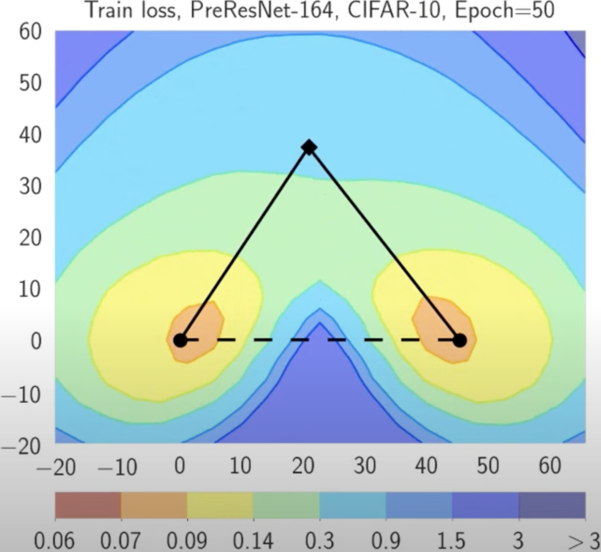
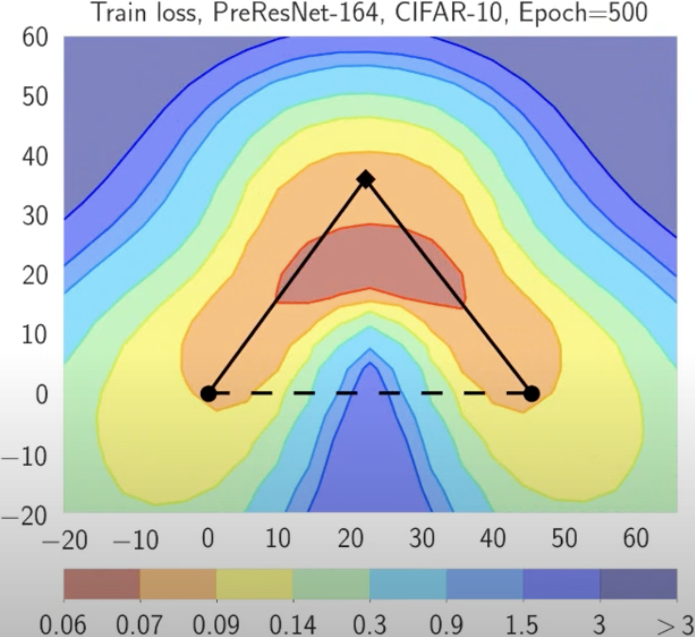
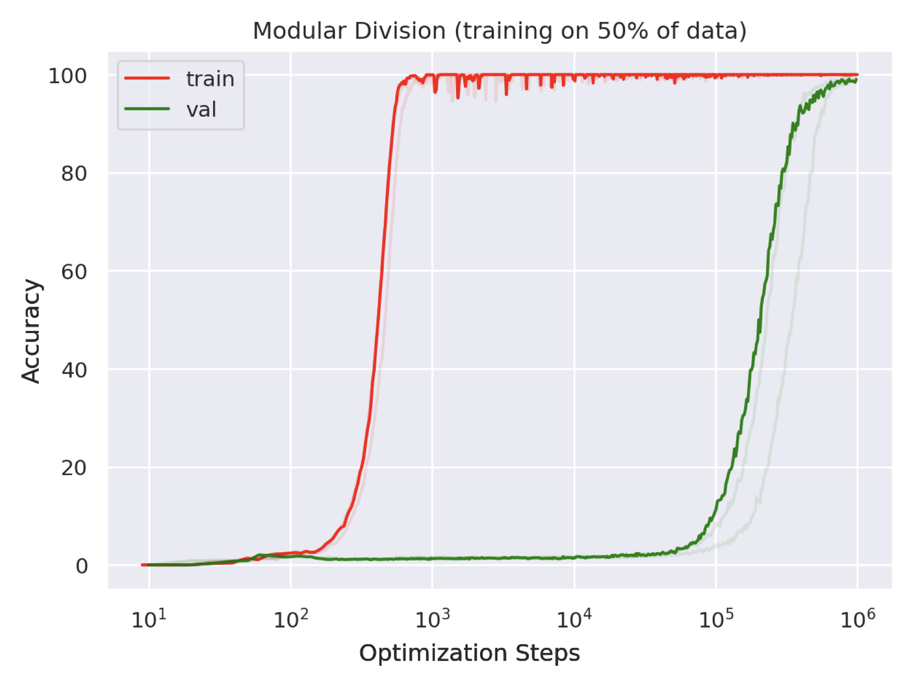

# SAM
## Плоский минимум vs Острый минимум
{width=80% fig-align="center"}

. . .

::: {.callout-question title="Острый минимум"}
Что не так с острым минимумом?
:::

## Sharpness-Aware Minimization \footnote{\href{https://arxiv.org/pdf/2010.01412}{Foret, Pierre, et al. "Sharpness-aware minimization for efficiently improving generalization." (2020)}}

:::: {.columns}

::: {.column width="50%"}
{width=60% fig-align="center"}
:::

. . .

::: {.column width="50%"}
{width=60% fig-align="center"}
:::

::::

. . .

::: {.callout-tip icon="false" appearance="simple"}
Sharpness-Aware Minimization (SAM) — это процедура, целью которой является улучшение обобщающей способности модели путем одновременной минимизации значения функции потерь и **остроты (sharpness) функции потерь**.
:::

## Постановка задачи обучения

Обучающая выборка, полученная $i.i.d.$ из распределения $D$:
$$S = \{(x_i, y_i)\}_{i=1}^{n},$$
где $x_i$ — вектор признаков, а $y_i$ — метка.

. . .

Функция потерь на обучающей выборке:
$$L_{S} = \dfrac{1}{n} \sum_{i=1}^{n} l(\boldsymbol{w}, x_i, y_i),$$ 
где $l$ — функция потерь для одного объекта, $\boldsymbol{w}$ — параметры. 

. . .

Функция потерь на генеральной совокупности (population loss):
$$L_{D} = \mathbb{E}_{(x, y)} [l(\boldsymbol{w}, \boldsymbol{x}, \boldsymbol{y})]$$

## Что такое sharpness (острота)?

:::{.callout-theorem}
Для любого $\rho>0$, с высокой вероятностью по обучающей выборке $S$, сгенерированной из распределения $D$,
$$
L_{D}(\boldsymbol{w}) \leq \max _{\|\boldsymbol{\epsilon}\|_2 \leq \rho} L_{S}(\boldsymbol{w}+\boldsymbol{\epsilon})+h\left(\|\boldsymbol{w}\|_2^2 / \rho^2\right),
$$
где $h: \mathbb{R}_{+} \rightarrow \mathbb{R}_{+}$ — строго возрастающая функция (при некоторых технических условиях на $L_{D}(\boldsymbol{w})$).
:::

. . .

Добавляя и вычитая $L_{S}(\boldsymbol{w})$:
$$
\left[\max _{\|\in\|_2 \leq \rho} L_{{S}}(\boldsymbol{w}+\boldsymbol{\epsilon})-L_{{S}}(\boldsymbol{w})\right]+L_{\mathcal{S}}(\boldsymbol{w})+h\left(\|\boldsymbol{w}\|_2^2 / \rho^2\right)
$$

Слагаемое в квадратных скобках отражает **остроту (sharpness)** $L_S$ в точке $\boldsymbol{w}$, измеряя, как быстро может возрасти ошибка обучения при переходе от $\boldsymbol{w}$ к близкому значению параметров.

## Sharpness-Aware Minimization

Функция $h$ заменяется на более простую константу $\lambda$. Авторы предлагают выбирать значения параметров, решая следующую задачу Sharpness-Aware Minimization (SAM):

$$
\min _{\boldsymbol{w}} L_{{S}}^{S A M}(\boldsymbol{w})+\lambda\|\boldsymbol{w}\|_2^2 \quad \text { где } \quad L_{{S}}^{S A M}(\boldsymbol{w}) \triangleq \max _{\|\epsilon\|_p \leq \rho} L_S(\boldsymbol{w}+\boldsymbol{\epsilon}),
$$

с гиперпараметром $\rho \geq 0$ и $p$ из $[1, \infty]$ (небольшое обобщение, хотя $p=2$ эмпирически является лучшим выбором).

## Как минимизировать $L_{{S}}^{S A M}$?

Для минимизации $L_{{S}}^{S A M}$ используется эффективная аппроксимация его градиента. Первым шагом рассматривается разложение Тейлора первого порядка для $L_{{S}}(\boldsymbol{w}+\boldsymbol{\epsilon})$:
$$
\boldsymbol{\epsilon}^*(\boldsymbol{w}) \triangleq \underset{\|\epsilon\|_p \leq \rho}{\arg \max } \left\{ L_{{S}}(\boldsymbol{w}+\boldsymbol{\epsilon}) \right\}  
\approx \underset{\|\epsilon\|_p \leq \rho}{\arg \max } \left\{ L_{{S}}(\boldsymbol{w})+\boldsymbol{\epsilon}^T \nabla_{\boldsymbol{w}} L_{{S}}(\boldsymbol{w}) \right\}
=\underset{\|\epsilon\|_p \leq \rho}{\arg \max } \left\{ \boldsymbol{\epsilon}^T \nabla_{\boldsymbol{w}} L_{{S}}(\boldsymbol{w}) \right\} .
$$

. . .

Последнее выражение — это просто argmax скалярного произведения векторов $\boldsymbol{\epsilon}$ и $\nabla_{\boldsymbol{w}} L_{{S}}(\boldsymbol{w})$, и хорошо известно, какой аргумент его максимизирует:

$$
\hat{\boldsymbol{\epsilon}}(\boldsymbol{w})=\rho \operatorname{sign}\left(\nabla_{\boldsymbol{w}} L_{{S}}(\boldsymbol{w})\right)\left|\nabla_{\boldsymbol{w}} L_{{S}}(\boldsymbol{w})\right|^{q-1} /\left(\left\|\nabla_{\boldsymbol{w}} L_{{S}}(\boldsymbol{w})\right\|_q^q\right)^{1 / p},
$$
где $1 / p+1 / q=1$.

. . .

Таким образом
$$
\begin{aligned}
\nabla_{\boldsymbol{w}} L_{{S}}^{S A M}(\boldsymbol{w}) & \approx \nabla_{\boldsymbol{w}} L_{{S}}(\boldsymbol{w}+\hat{\boldsymbol{\epsilon}}(\boldsymbol{w}))=\left.\frac{d(\boldsymbol{w}+\hat{\boldsymbol{\epsilon}}(\boldsymbol{w}))}{d \boldsymbol{w}} \nabla_{\boldsymbol{w}} L_{{S}}(\boldsymbol{w})\right|_{\boldsymbol{w}+\hat{\boldsymbol{\epsilon}}(w)} \\
& =\left.\nabla_w L_{{S}}(\boldsymbol{w})\right|_{\boldsymbol{w}+\hat{\boldsymbol{\epsilon}}(\boldsymbol{w})}+\left.\frac{d \hat{\boldsymbol{\epsilon}}(\boldsymbol{w})}{d \boldsymbol{w}} \nabla_{\boldsymbol{w}} L_{{S}}(\boldsymbol{w})\right|_{\boldsymbol{w}+\hat{\boldsymbol{\epsilon}}(\boldsymbol{w})}
\end{aligned}
$$

## Sharpness-Aware Minimization

Современные фреймворки могут легко вычислить предыдущее приближение. Однако для ускорения вычислений члены второго порядка можно отбросить, получая:
$$
\left.\nabla_{\boldsymbol{w}} L_{{S}}^{S A M}(\boldsymbol{w}) \approx \nabla_{\boldsymbol{w}} L_{{S}}(w)\right|_{\boldsymbol{w}+\hat{\boldsymbol{\epsilon}}(\boldsymbol{w})}
$$

. . .

{width=100% fig-align="center"}

## Результаты SAM

{width=50% fig-align="center"}

<!-- # Методы уменьшения дисперсии (Variance Reduction) для нейросетей

## Почему методы VR не работают при обучении нейронных сетей? \footnote{\href{https://arxiv.org/abs/1812.04529}{Defazio, A., Bottou, L. (2019). On the ineffectiveness of variance reduced optimization for deep learning. Advances in Neural Information Processing Systems, 32.}}

:::: {.columns}
::: {.column width="45%"}

\begin{figure}
  \centering
  \begin{minipage}[b]{0.49\linewidth}
    \centering
    \includegraphics[width=\linewidth]{../files/variance_ratios_densenet.pdf}
    \caption{DenseNet}
  \end{minipage}%
  \begin{minipage}[b]{0.49\linewidth}
    \centering
    \includegraphics[width=\linewidth]{../files/variance_ratios_small-resnet.pdf}
    \caption{Small ResNet}
  \end{minipage}

  \vspace{1em} % небольшой отступ между рядами

  \begin{minipage}[b]{0.49\linewidth}
    \centering
    \includegraphics[width=\linewidth]{../files/variance_ratios_lenet.pdf}
    \caption{LeNet‑5}
  \end{minipage}%
  \begin{minipage}[b]{0.49\linewidth}
    \centering
    \includegraphics[width=\linewidth]{../files/variance_ratios_resnet110.pdf}
    \caption{ResNet‑110}
  \end{minipage}
\end{figure}

:::

::: {.column width="55%"}
- **SVRG / SAG** дают убедительный выигрыш в выпуклых задачах, но на CIFAR-10 (LeNet-5) и ImageNet (ResNet-18) они не превосходят стандартный SGD. \pause
- Измеренное отношение "дисперсия SGD / дисперсия SVRG" остается $\lesssim 2$ для большинства слоев — это означает, что реальное снижение шума минимально. \pause
- Возможные причины:  
  - **Аугментация данных** делает опорный градиент $g_{\text{ref}}$ устаревшим уже через несколько мини-батчей. \pause
  - **BatchNorm** и **Dropout** вносят внутреннюю стохастичность, которая не может быть скомпенсирована прошлым $g_{\text{ref}}$. \pause
  - Дополнительный полный проход по датасету (для вычисления $g_{\text{ref}}$) съедает потенциальную экономию итераций. \pause
- "Потоковые" модификации SVRG, разработанные для работы с аугментацией, уменьшают теоретическое смещение, но все равно проигрывают SGD как по времени, так и по качеству. \pause
- **Вывод**: Существующие методы уменьшения дисперсии непрактичны для современных глубоких сетей; будущие решения должны учитывать стохастическую природу архитектуры и данных (аугментация, BatchNorm, Dropout).
:::
:::: -->

# Связность мод (Mode Connectivity)
## Связность мод (Mode Connectivity) \footnote{\href{https://arxiv.org/pdf/1802.10026}{Garipov, T., Izmailov, P., Podoprikhin, D., Vetrov, D. P., Wilson, A. G. (2018). Loss surfaces, mode connectivity, and fast ensembling of dnns. Advances in neural information processing systems, 31.}} 
![Поверхность функции потерь (кросс-энтропия с $l_2$-регуляризацией) для ResNet-164 на CIFAR-100 как функция весов сети в двумерном подпространстве. На каждом графике горизонтальная ось фиксирована и проходит через оптимумы двух независимо обученных сетей. Вертикальная ось меняется между графиками при смене плоскостей (определенных в основном тексте). Слева: Три оптимума для независимо обученных сетей. В центре и справа: Квадратичная кривая Безье и ломаная с одним изгибом, соединяющие два нижних оптимума с левого графика вдоль пути с почти постоянной функцией потерь. Заметьте, что на каждом графике прямой линейный путь между модами привел бы к высоким потерям.](../files/mode_connectivity.png){width=80% fig-align="center"}

## Процедура поиска кривой

:::: {.columns}

::: {.column width="50%"}

- Веса предобученных сетей: 

$$\widehat{w}_1, \widehat{w}_2 \in \mathbb{R}^{\mid \text {net} \mid}$$

- Определим параметрическую кривую: $\phi_\theta(\cdot):[0,1] \rightarrow \mathbb{R}^{\mid \text {net} \mid}$

$$
\phi_\theta(0)=\widehat{w}_1, \quad \phi_\theta(1)=\widehat{w}_2
$$

- Функция потерь DNN: 

$$\mathcal{L}(w)$$

- Минимизируем усредненную функцию потерь по $\theta$:

$$
\underset{\theta}{\operatorname{minimize}} \;\; \ell(\theta)=\int_0^1 \mathcal{L}\left(\phi_\theta(t)\right) d t=\mathbb{E}_{t \sim U(0,1)} \mathcal{L}\left(\phi_\theta(t)\right)
$$

:::

::: {.column width="50%"}
{width=70% fig-align="center"}
:::

::::

## Процедура поиска кривой

:::: {.columns}

::: {.column width="50%"}

- Веса предобученных сетей: 

$$\widehat{w}_1, \widehat{w}_2 \in \mathbb{R}^{\mid \text {net} \mid}$$

- Определим параметрическую кривую: $\phi_\theta(\cdot):[0,1] \rightarrow \mathbb{R}^{\mid \text {net} \mid}$

$$
\phi_\theta(0)=\widehat{w}_1, \quad \phi_\theta(1)=\widehat{w}_2
$$

- Функция потерь DNN: 

$$\mathcal{L}(w)$$

- Минимизируем усредненную функцию потерь по $\theta$:

$$
\underset{\theta}{\operatorname{minimize}} \;\; \ell(\theta)=\int_0^1 \mathcal{L}\left(\phi_\theta(t)\right) d t=\mathbb{E}_{t \sim U(0,1)} \mathcal{L}\left(\phi_\theta(t)\right)
$$

:::

::: {.column width="50%"}
{width=70% fig-align="center"}
:::

::::

## Процедура поиска кривой

:::: {.columns}

::: {.column width="50%"}

- Веса предобученных сетей: 

$$\widehat{w}_1, \widehat{w}_2 \in \mathbb{R}^{\mid \text {net} \mid}$$

- Определим параметрическую кривую: $\phi_\theta(\cdot):[0,1] \rightarrow \mathbb{R}^{\mid \text {net} \mid}$

$$
\phi_\theta(0)=\widehat{w}_1, \quad \phi_\theta(1)=\widehat{w}_2
$$

- Функция потерь DNN: 

$$\mathcal{L}(w)$$

- Минимизируем усредненную функцию потерь по $\theta$:

$$
\underset{\theta}{\operatorname{minimize}} \;\; \ell(\theta)=\int_0^1 \mathcal{L}\left(\phi_\theta(t)\right) d t=\mathbb{E}_{t \sim U(0,1)} \mathcal{L}\left(\phi_\theta(t)\right)
$$

:::

::: {.column width="50%"}
{width=70% fig-align="center"}
:::

::::

# Гроккинг (Grokking)
## Гроккинг (Grokking)^[[Power, Alethea, et al. "Grokking: Generalization beyond overfitting on small algorithmic datasets." (2022).](https://arxiv.org/pdf/2201.02177)]

:::: {.columns}

::: {.column width="40%"}

- После достижения нулевой ошибки на обучении веса продолжают изменяться в манере, напоминающей случайное блуждание    

- Возможно, они медленно дрейфуют к более широкому минимуму

- Недавно открытый эффект гроккинга подтверждает эту гипотезу

:::

::: {.column width="60%"}
{width=70% fig-align="center"}

:::

::::

# Двойной спуск (Double Descent)
## Двойной спуск (Double Descent)^[[Belkin, Mikhail, et al. "Reconciling modern machine-learning practice and the classical bias–variance trade-off." (2019)](https://arxiv.org/pdf/1812.11118)]

![Кривые риска обучения (пунктирная линия) и тестового риска (сплошная линия). (a) Классическая U-образная кривая риска, возникающая из компромисса смещения и дисперсии (bias-variance trade-off). (b) Кривая риска двойного спуска, которая объединяет U-образную кривую риска (т.е. «классический» режим) с наблюдаемым поведением на моделях высокой размерности (т.е. «современный» интерполяционный режим), разделенных порогом интерполяции. Предикторы справа от порога интерполяции имеют нулевой риск обучения.](../files/double_descent.png){width=100% fig-align="center"}

## Двойной спуск (Double Descent)

# Shampoo и Muon
## Shampoo \footnote{\href{https://arxiv.org/pdf/1802.09568}{Gupta, V., Koren, T. and Singer, Y., 2018, July. Shampoo: Preconditioned stochastic tensor optimization. In International Conference on Machine Learning (pp. 1842-1850). PMLR.
}}

Расшифровывается как **S**tochastic **H**essian-**A**pproximation **M**atrix **P**reconditioning for **O**ptimization **O**f deep networks. Это метод, вдохновленный оптимизацией второго порядка, разработанный для глубокого обучения больших моделей.

**Основная идея:** Аппроксимирует полноматричный предобуславливатель AdaGrad, используя эффективные матричные структуры, в частности произведения Кронекера.

Для матрицы весов $W \in \mathbb{R}^{m \times n}$ обновление включает предобуславливание с использованием аппроксимаций матриц статистики $L \approx \sum_k G_k G_k^T$ и $R \approx \sum_k G_k^T G_k$, где $G_k$ — градиенты.

Упрощенная концепция:

1. Вычислить градиент $G_k$.
2. Обновить статистики $L_k = \beta L_{k-1} + (1-\beta) G_k G_k^T$ и $R_k = \beta R_{k-1} + (1-\beta) G_k^T G_k$.
3. Вычислить предобуславливатели $P_L = L_k^{-1/4}$ и $P_R = R_k^{-1/4}$. (Обратный матричный корень)
4. Обновить: $W_{k+1} = W_k - \alpha P_L G_k P_R$.

. . .

**Заметки:**

* Нацелен на более эффективный учет информации о кривизне, чем методы первого порядка.
* Вычислительно дороже, чем Adam, но может сходиться быстрее или к лучшим решениям с точки зрения количества шагов.
* Требует тщательной реализации для эффективности (например, эффективное вычисление обратных матричных корней, работа с большими матрицами).
* Существуют варианты для различных форм тензоров (например, сверточных слоев).

## Muon \footnote{\href{https://kellerjordan.github.io/posts/muon/}{K. Jordan blogpost "Muon: An optimizer for hidden layers in neural networks". 2024.}} \footnote{\href{https://jeremybernste.in/writing/deriving-muon}{J. Bernstein blogpost "Deriving Muon". 2025.}} \footnote{\href{https://arxiv.org/pdf/2503.12645}{Kovalev, D. (2025). Understanding Gradient Orthogonalization for Deep Learning via Non-Euclidean Trust-Region Optimization. arXiv preprint arXiv:2503.12645.}}

$$
\begin{aligned}
W_{t+1} &= W_t - \eta (G_tG_t^\top)^{-1/4}G_t(G_t^\top G_t)^{-1/4} \\
&= W_t - \eta (US^2U^\top)^{-1/4} (USV^\top) (VS^2V^\top)^{-1/4} \\
&= W_t - \eta (US^{-1/2}U^\top) (USV^\top) (VS^{-1/2}V^\top) \\
&= W_t - \eta US^{-1/2}SS^{-1/2}V^\top \\
&= W_t - \eta UV^\top
\end{aligned}
$$

## Сравнение Muon с AdamW на LogReg

\href{https://colab.research.google.com/github/MerkulovDaniil/hse25/blob/main/notebooks/s_17_muon.ipynb}{\faPython\ Простое сравнение Muon и AdamW на небольшой задаче LogReg}

# Дополнительные материалы
## Дополнительные материалы

- \href{https://youtu.be/d60ShbSAu4A?si=UWqr7jamkJQ4W3XL}{\faYoutube\ Д. Ветров "Удивительные свойства ландшафта функции потерь в перепараметризованных моделях"}
- \href{https://www.youtube.com/watch?v=pmHkDKPg0WM}{\faYoutube\ В. Голощапов "О чем не гроккинг"}
- \href{https://broadcast.comdi.com/watch/ra9y3cd0}{\faVideo\ Д. Ковалев "Understanding Gradient Orthogonalization for Deep Learning via Non-Euclidean Trust-Region Optimization" (Теория за Muon)}
