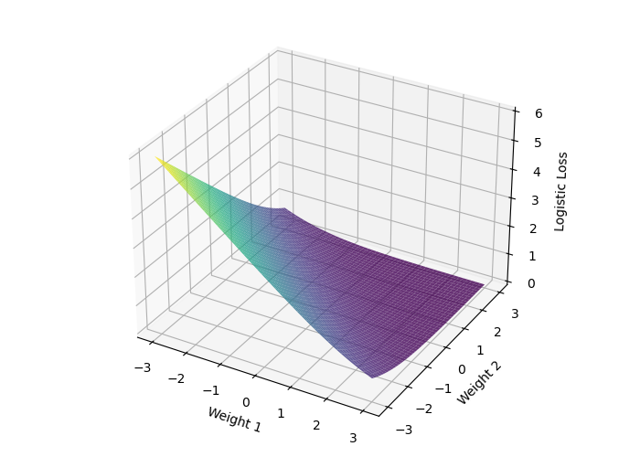
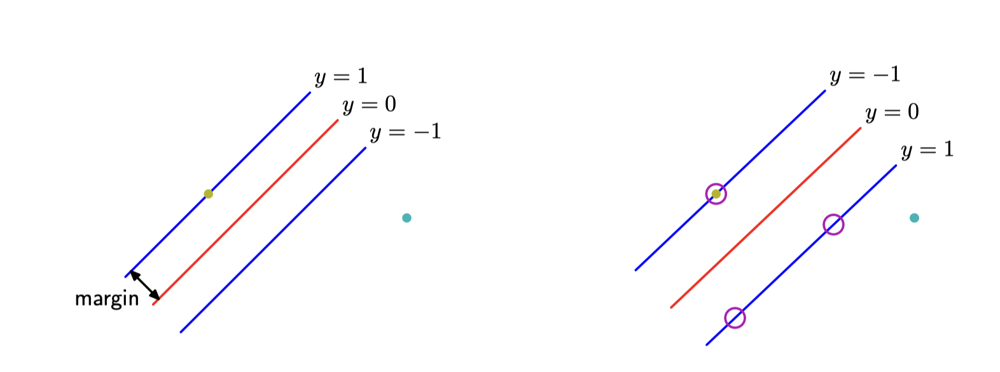
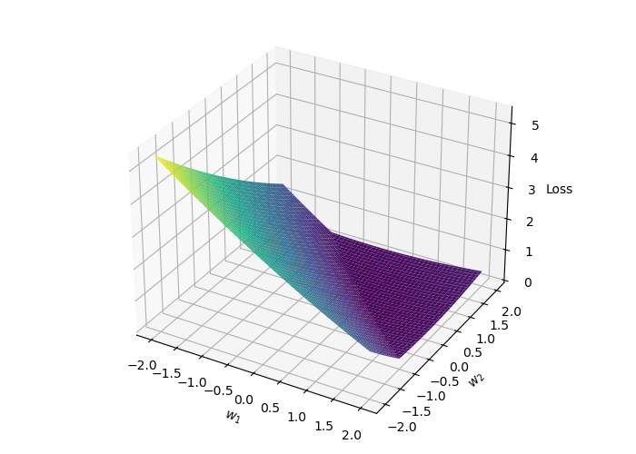

# Напоминание с лекции

# Выпуклые множества

## Отрезок

Пусть $x_1, x_2$ два вектора в $\mathbb{R}^n$. Тогда отрезок, проходящий через них, определяется следующим образом:

$$
x = \theta x_1 + (1 - \theta)x_2, \; \theta \in [0,1]
$$

{width=200}

## Выпуклое множество

Множество $S$ называется **выпуклым**, если для любых $x_1, x_2$ из $S$ отрезок между ними также лежит в $S$, т.е. 

$$
\forall \theta \in [0,1], \; \forall x_1, x_2 \in S: \theta x_1 + (1- \theta) x_2 \in S
$$

::: {.callout-example}
Любое аффинное множество, луч, отрезок - все они являются выпуклыми множествами.
:::

{width=200}

## Задача 1

::: {.callout-question}
Докажите, что шар в $\mathbb{R}^n$ (т.е. множество $\{ \mathbf{x} \mid \Vert \mathbf{x} - \mathbf{x}_c \Vert \leq r \}$) - является выпуклым.
:::

## Задача 2

::: {.callout-question}
Является ли полоса $\{x \in \mathbb{R}^n \mid \alpha \leq a^\top x \leq \beta \}$ выпуклой?
:::

## Задача 3

::: {.callout-question}
Пусть $S$ такое, что $\forall x,y \in S \to \frac{1}{2}(x+y) \in S$. Является ли это множество выпуклым?
:::

## Задача 4

::: {.callout-question}
Является ли множество $S = \{x \; | \; x + S_2 \subseteq S_1\}$, где $S_1,S_2 \subseteq \mathbb{R}^n$ с выпуклым $S_1$, выпуклым?
:::

# Функции

## Выпуклая функция

Функция $f(x)$, **определенная на выпуклом множестве** $S \subseteq \mathbb{R}^n$, называется **выпуклой** на $S$, если:

$$
f(\lambda x_1 + (1 - \lambda)x_2) \le \lambda f(x_1) + (1 - \lambda)f(x_2)
$$

для любых $x_1, x_2 \in S$ и $0 \le \lambda \le 1$.  
Если вышеуказанное неравенство выполняется как строгое неравенство $x_1 \neq x_2$ и $0 < \lambda < 1$, то функция называется **строго выпуклой** на $S$.

{width=250}

## Сильная выпуклость

$f(x)$, **определенная на выпуклом множестве** $S \subseteq \mathbb{R}^n$, называется $\mu$-сильно выпуклой (сильно выпуклой) на $S$, если:

$$
f(\lambda x_1 + (1 - \lambda)x_2) \le \lambda f(x_1) + (1 - \lambda)f(x_2) - \frac{\mu}{2} \lambda (1 - \lambda)\|x_1 - x_2\|^2
$$

для любых $x_1, x_2 \in S$ и $0 \le \lambda \le 1$ для некоторого $\mu > 0$.

{width=250}

# Критерии выпуклости

## Дифференциальный критерий выпуклости первого порядка
Дифференцируемая функция $f(x)$ определенная на выпуклом множестве $S \subseteq \mathbb{R}^n$ является выпуклой тогда и только тогда, когда $\forall x,y \in S$:
$$
f(y) \ge f(x) + \nabla f^T(x)(y-x)
$$
Пусть $y = x + \Delta x$, тогда критерий станет более удобным:

$$
f(x + \Delta x) \ge f(x) + \nabla f^T(x)\Delta x
$$

{width=150}

## Дифференциальный критерий выпуклости второго порядка
Дважды дифференцируемая функция $f(x)$ определенная на выпуклом множестве $S \subseteq \mathbb{R}^n$ является $\mu$-сильно выпуклой тогда и только тогда, когда $\forall x \in \mathbf{int}(S) \neq \emptyset$:

$$
\nabla^2 f(x) \succeq \mu I
$$

Другими словами:

$$
\langle y, \nabla^2f(x)y\rangle \geq \mu \|y\|^2
$$

## Эксперимент с JAX

Почему выпуклость и сильная выпуклость важны? Проверьте простой [\faPython код](https://colab.research.google.com/drive/14qPF7fkCWAoKcmFbN0Up4V0LMR287Nch?usp=sharing).

## Задача 5

::: {.callout-question}
Докажите, что $f(x) = \|x\|$ является выпуклой на $\mathbb{R}^n$.
:::

::: {.callout-question}
Докажите, что $f(x) = x^\top Ax$, где $A\succeq 0$ - является выпуклой на $\mathbb{R}^n$.
:::

## Задача 6

::: {.callout-question}
Докажите, что если $f(x)$ является выпуклой на $\mathbb{R}^n$, то $\exp(f(x))$ является выпуклой на $\mathbb{R}^n$.
:::

## Задача 7

::: {.callout-question}
Докажите, что если $f(x)$ является выпуклой неотрицательной функцией и $p \ge 1$, то $g(x)=f(x)^p$ является выпуклой.
:::

## Задача 8

::: {.callout-question}
Докажите, что если $f(x)$ является вогнутой положительной функцией над выпуклым $S$, то $g(x)=\frac{1}{f(x)}$ является выпуклой.
:::

::: {.callout-question}
Докажите, что следующая функция является выпуклой на множестве всех положительных знаменателей
$$
f(x) = \dfrac{1}{x_1 - \dfrac{1}{x_2 - \dfrac{1}{x_3 - \dfrac{1}{\ldots}}}}, x \in \mathbb{R}^n
$$
:::

## Задача 9

::: {.callout-question}
Пусть $S = \{x \in \mathbb{R}^n \; \vert \; x \succ 0, \Vert x \Vert_{\infty} \leq M \}$. Докажите, что $f(x)=\sum_{i=1}^n x_i \log x_i$ является $\frac{1}{M}$-сильно выпуклой.
:::

# Условие Поляка - Лоясиевича

## Условие Поляка - Лоясиевича

Условие Поляка - Лоясиевича выполняется, если выполняется следующее условие для некоторого $\mu > 0$,
$$
\Vert \nabla f(x) \Vert^2 \geq \mu (f(x) - f^*) \forall x
$$
Пример функции, которая удовлетворяет условию Поляка - Лоясиевича, но не является выпуклой.
$$
f(x,y) = \dfrac{(y - \sin x)^2}{2}
$$

Пример невыпуклой функции, удовлетворяющей условию Поляка - Лоясиевича [\faPython Open in Colab](https://colab.research.google.com/github/MerkulovDaniil/optim/blob/master/assets/Notebooks/PL_function.ipynb).

# Практические примеры

## Логистическая регрессия

::: {.columns}
::: {.column width=60%}
::: {.callout-note}
## Дано
$X \in \mathbb{R}^{m \times n}, y \in \{0, 1\}^n$.
:::

. . .

::: {.callout-important}
## Найти
Найти функцию, которая переводит объект $x$ в вероятность $p(y=1| x)$:

$p: \mathbb R^m \to (0, 1)$, $p(x) \equiv \sigma(x^Tw) = \frac{1}{1 + \exp(-x^T w)}$
:::

. . .

::: {.callout-tip}
## Критерий
Двоичная кросс-энтропия (лог-потери):
$L(p, X, y) = -\sum_{i=1}^n y_i \log p\left( X_i \right) + \left( 1 - y_i \right) \log \left(1 - p\left( X_i \right) \right),$
которая минимизируется относительно $w$.
:::

. . .

:::
::: {.column width=38%}
  
Мы можем сделать эту задачу $\mu$-сильно выпуклой, если рассмотрим регуляризованную логистическую потерю как критерий: $L(p, X, y) + \frac{\mu}{2} \| w \|_2^2$.
:::
:::

Рассотрите [\faPython\ эксперименты по логистической регрессии](https://colab.research.google.com/github/MerkulovDaniil/hse25/blob/main/notebooks/s4_benchmarx_convex.ipynb).

## Метод опорных векторов (SVM)

::: {.columns}
::: {.column width=60%}
::: {.callout-note}

## Дано

$X \in \mathbb{R}^{m \times n}, y \in \{-1, 1\}^n$.
:::

. . .

::: {.callout-important}
## Найти

Найти гиперплоскость, которая максимизирует маржу между двумя классами:

$f: \mathbb{R}^m \to \{-1, 1\},\ f(x) = \text{sign}(w^T x + b)$.
:::

. . .

::: {.callout-tip}
## Критерий

Шарнирная функция потерь:

$L(w, X, y) = \frac{1}{2} \|w\|_2^2 + C\sum_{i=1}^n \max(0, 1 - y_i (X_i^T w + b)),$
которая минимизируется относительно $w$ и $b$.

:::

Эта задача является сильно выпуклой из-за квадратичной евклидовой нормы.

Рассмотрите [\faPython\ эксперименты по SVM в том же ноутбуке](https://colab.research.google.com/github/MerkulovDaniil/hse25/blob/main/notebooks/s4_benchmarx_convex.ipynb).

. . .

:::
::: {.column width=38%}
{width=80%}

{width=80%}
:::
:::

## Некоторые любопытные примеры

- \textbf{Приближение низкоранговой матрицы}
$$\min_X \|A - X\|_F^2\ \text{s.t.}\ rank(X) \le k.$$

. . . 

::: {.callout-question}
Является ли это выпуклым?
:::

. . .

По теореме Эккарта-Янга это можно решить с помощью SVD: $X^* = U_k \Sigma_k V_k^T$, где $A = U \Sigma V^T$.

. . .

- \textbf{Выпуклая релаксация через ядерную норму}
$$
\min_X rank(X),\ \text{s.t.}\ X_{ij} = M_{ij},\ (i, j) \in I.
$$

. . .

NP-сложная задача, но $\|A\|_* = trace(\sqrt{A^T A}) = \sum_{i=1}^{rank(A)} \sigma_i(A)$ 
является выпуклой оболочкой ранга матрицы.
